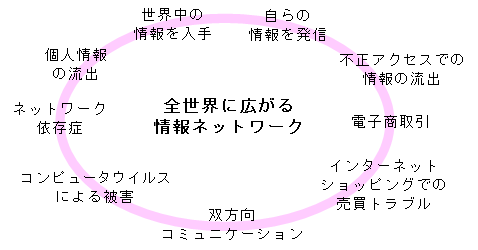
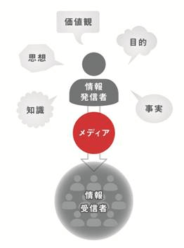
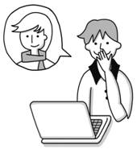
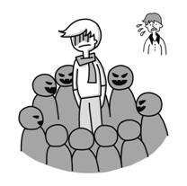
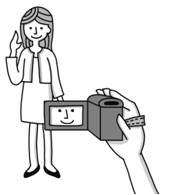
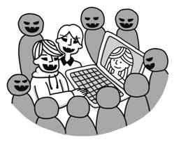

第４講で情報倫理を学習した後、受講生は全員、「情リテ情報倫理テスト」に取り組んでください。

実施期間は、第４講の授業時間内または、終了後、一週間以内の授業時間外とします。
８割の正解をもって合格としますので、不合格者は到達するまで繰り返し行ってください。

（以上、担当の先生の指示にしたがって行ってください）

情報活用能力
------------

高度情報社会の到来が叫ばれるようになって久しいですが､現在､我々はIT（Information Technology）が生活の隅々まで入り込んだ環境の中で募らしています。これに加え、ICT（Information and Communication Technology）という文言が示唆するように、ITはコミュニケーションする際になくてはならない、人と人をつなぐ道具としてその真価を発揮するようになってきています。つまり、情報や知識を個人のものとするだけでなく、テクノロジーを用いた相互作用を通して皆と共有したり創造したりすることが盛んに行われているわけです。

このように情報が行き交い、あふれる社会では、情報手段を適切に活用する中で必要な情報を主体的に収集・判断・表現・処理・創造しその後、発信・伝達できる能力（情報活用の実践力）を獲得することが重要です。また、その能力を培うためには、多様な情報や情報手段の特性の理解と情報を適切に扱うことや自らの情報活用を評価し改善する際の基礎的な理論や方法の理解（情報の科学的な理解）も必要でしょう。そして、ただ情報やそれに関わる技術を理解し扱うだけでなく、我々の社会における情報や情報技術の役割やその影響を理解し、情報モラルや情報への責任について考え、望ましい情報社会の創造に参画しようとする態度（情報社会に参画する態度）が、また、不可欠です。

これら３つの素養は、これまでみなさんが学習を進めてきたところですが、大学では更にそれらを深化させ、バランス良い情報活用能力として身に付けることが重要であり、これからの社会人として求められることになると考えられます。

課題の解決
----------

次に人が生きていく上では、前述した情報活用能力を用いて実際の課題の解決に取り組む場面が多くあります。問題解決の過程では、情報を検索、処理したり、編集したりといった活動は必ず含まれるものですから、基礎的な手続きを行う能力としての情報活用能力は有用です。更に、問題解決では、総合的に判断したり、反省的に捉えたりするといったメタ認知的な思考が必要になります。

よく知られた数学に関する問題解決の方略としては、G.ポリア（いかにして問題を解くか、丸善、1954）が問題解決の過程を（1）問題を理解する、（2）計画を立てる、（3）計画を実行する、（4）振り返ってみる、という４段階で記述しています。これは、現在の我々が見ても参考になるものですが、松原（情報科教育法、開隆堂、2003）はそれを更に細分化し問題解決の過程を示しており、みなさんが、今後取り組む課題の解決などに際して示唆的でしょう。

<table>
<caption>問題解決の9段階</caption>
<tbody>
<tr>
<th>1</th><td>問題の意識</td><td>抽象的または直感的に問題を意識する段階</td>
</tr><tr>
<th>2</th><td>問題の分析</td><td>その問題を客観化・一般化する段階</td>
</tr><tr>
<th>3</th><td>問題の照合</td><td>既に一般化された問題と照合する段階</td>
</tr><tr>
<th>4</th><td>解決法の照合</td><td>既に一般化された方法の中から解決の糸口を見いだす段階</td>
</tr><tr>
<th>5</th><td>解決法の修正</td><td>一般化された解決の方法を問題に適合するように部分的に修正する段階</td>
</tr><tr>
<th>6</th><td>解決法の意識</td><td>解決の方法を具体化して意識する段階</td>
</tr><tr>
<th>7</th><td>解決法の実行</td><td>意識した解決法を実行する段階</td>
</tr><tr>
<th>8</th><td>解決法の評価</td><td>実行した結果を評価し、問題の解決の効果を検討する段階</td>
</tr><tr>
<th>9</th><td>解決法の一般化</td><td>修正した解決法を一般化する段階</td>
</tr>
</tbody>
</table>

ここで重要なことは、例えば、本章のタイトルにあるように「情報」という文言が含まれているとパソコンの使い方を勉強するものだと思ってしまいがちですが、連関はあるものの、それ以上にそういったツールを用いて如何に情報を扱っていくかが重要となります。つまり、ここで取り上げた問題の解決法について学ぶといったメタ認知的なスキルの習得が、これから皆さんが関わっていく高等教育や実社会では必要不可欠なのです。

### 協調的な課題解決

上述した課題の解決では、主に一人で活動する場合を想像しがちですが、実際の大学での学習や社会での仕事では、複数のメンバーが参加している形態が多く、知識の共有や協調的な議論を通しての問題解決が行われることが少なくありません。これら協調的な問題解決に関しては、鈴木（教育工学事典、実教出版、2000）が以下のような良さをあげています。

-   他者が存在することにより、仮説の説明、吟味がなされやすい
-   複数の人間の間で役割の分担が生じる
-   異なるバックグラウンドを持つ参加者がいることで、類推が生じやすくなる

このような問題解決こそが、コミュニティヘの参加と文化創造を強調する意味で、一般社会での問題解決と近接しており、より実際的な課題解決の方略であるとの主張があります。

コミュニケーション能力とプレゼンテーション能力
----------------------------------------------

ここでは、情報化社会を生きていく上で、注目されている２つの資質について取りあげます。前述したように、課題解決を遂行する実際の場面では、複数の人間が協力して問題に取り組むことが多いものですが、そこで、注目されるのがコミュニケーション能力です。菅井（教育工学事典、実教出版、2000）は、コミュニケーションの形式を以下のように２つ提示しています。

<dl>
<dt>対話（ダイアログ）的コミュニケーション形式</dt>
<dd>情報を生成するために、人間はさまざまな情報を交換し合う。そうすることによって、 新たな情報が合成される。</dd>
<dt>ディスコース（言説）的コミュニケーション形式</dt>
<dd>記憶し蓄積した既存のさまざまな情報を、人間はコミュニケーションを介して分配する。</dd>
</dl>

このようなコミュニケーションが、活動の文脈に応じて適切に行われる中で、情報の伝達や生成は成立するといえるでしょう。また、うまくコミュニケーションが行われれば、知識の社会的な構築や、問題解決が行われ、文化の創造につながっていくのです。

さて、次にプレゼンテーション能力に焦点をあててみましょう。前に情報活用の実践力として、情報を発信できる力をあげましたが、このプレゼンテーション能力もそれに関連する一つと考えられます。テレビ、新聞等のマスメディアでは、現在、学生の学力低下がよく危惧されていますが、しかし逆に昔の学生より、今の学生はプレゼンテーションの能力が高いなどということを聞くことがあります。このことは、一つにはコンピュータが身近になり、発表を効果的、効率的に行うツールが使えるようになったことに起因するのかもしれません。

プレゼンテーション能力のように多くの情報から必要な情報を取捨選択し、編集、加工する中で、自己の伝えたいことを的確にまとめ、外化していくことは、高度情報化社会の中では必須の能力であり、今後、社会的なニーズとも相まってより重要視されると考えられます。更に、限られた時開の中で、ポイントを押さえ、相手に分かりやすく情報を伝達するためのスキルは何もプレゼンテーションに限ったものではありません。このような能力が転移することで、他の高度な思考活動の促進にもつながると考えられます。

ブレインストーミング
--------------------

ブレインストーミング（Brain Storming、以下「ブレスト」）は、少人数の人々が特定の問題についてアイデアを出し合うことに特化した会議のことをいいます。頭脳（ブレーン）に嵐（ストーム）を引き起こして各参加者が一つの創造的な問題に攻撃的に取りかかることから「ブレーンストーム会議」と名づけられたことによります。ブレストの歴史は存外長く、1930年代にアメリカの大広告会社BBDOの社長、アレックス・オスボーンが用いた言葉であり、ブレスト誕生の経緯やアイデアを得る方法に関しては自著『Your Creative Power（日本語訳：創造力を生かす）』に詳細に書かれています。

オスボーン（創造力を生かす、豊田晃訳、創元社、2008）は、ブレストの参加者は以下に挙げる4つの基本原則を理解する必要があると述べています。

1.  判断力を排除する：アイデアを批判してはいけません。
1.  ”乱暴さ”を歓迎する：突拍子もないアイデアも思い切って出しましょう。
1.  量が必要：下手な鉄砲も数打てば当たるものです。
1.  結合と改良が大切：自分でアイデアを出すだけではなく、人の出したアイデアを改良したり、複数のアイデアを組み合わせることで新たなアイデアが生まれます。

ブレストの参加人数は基本的に5〜10人で、必ず進行役と書記役を1人ずつ決めます。

テーマは総括的なものよりも具体的なものを選びます。例えば「地球環境を守るためには」という総括的なテーマではなく、「首都大学東京が現在よりも使用電力を15％削減するためには」という具体的なテーマの方が、アイデアを出しやすく、また結論としてまとめることも容易になります。仮に立てたテーマでアイデアを考えたとき、1分以内に2つ以上思いつくことが、ふさわしいテーマであるかどうかの1つの目安です。

昨今、ブレストは企業でも多く取り入れられており、会社の企業目的に応じた独自のルールを設けているところもあります。

アイデアはアイデアの上に成り立ちます。1つのアイデアが他のアイデアを刺激することがブレストの目的であり、結果的には大きな利益を生むこともあります。ブレストはまさに無限の可能性を秘めているのかもしれません。

*   [本講義を用いたブレインストーミングの流れとテーマ例](./BS.pdf)
*   [TALL(305及び306室)説明資料](tall.pdf)

情報とモラル
------------

これまで、情報に関連して、人の振る舞いや持っている能力に焦点をあてて述べてきましたが、以下では、留意すべき側面を議論していきます。

### 情報化の光と影

情報化の光と影という言葉が使われるようになって久しいのですが、良さを追い求めるだけでなく、望ましくない側面も捉えようとする考えは、現在の社会において重要なことです。また、情報化がもたらす便利な点である「光」の部分と危険な点である「影」の部分の二者に分類するのではなく、情報化がもたらすものにはいろいろな側面があることを認識し、問題に対して共に議論していく姿勢が重要です。

### メディアリテラシー

情報に関わっていろいろな側面があると述べましたが、それらを的確に認識し捉えていくことは重要です。メディア・リテラシー（Media Literacy）とは、新聞、ラジオ、テレビ等の様々なメディアを使いこなし、それらメディアの提供する情報を読み解き、主体的に判断する能力のことを指していますが、情報化社会では重要なリテラシーといえるでしょう。

何となれば、メディアは常に現実の姿を伝えているとは限らず、そこには制作者の何らかの思想や価値観が入り込んでいる場合があり、その影響を私達は受けています。メディアに主体的に関わり、制作者の意図を見披き、固定観念や偏見といったものに批判的な能力を持つならば、このようなメディアのもつネガティブな側面に対応することができると考えられるからです。

### 情報モラル

モラルとは道徳や倫理のことであり、情報モラルとは、情報を送ったり受信したりする際の道徳を指します。現在、インターネット上では著作権侵害、不適切情報の授受、不正アクセス、コンピュータウイルスの配布等々、様々な不正行為が見られます。また、SNS（Social Networking Service）や電子掲示板、単文を投稿して情報共有できるサービス等の多種多様なコミュニティツール及び、動画配信サイトによって比較的容易に情報公開が可能になりました。したがって、個人の情報モラルが非常に重要となってきます。みなさんが自主自律して好ましい行動がとれるよう、単に情報モラルの項目を知識として学習するだけでなく、ネットワーク社会に実践的に参加する際に、他者の存在を感じそれらへの配慮を考える中で、ネットワーク社会での生き方を学んでいくようにしてください。

### 著作権

今述べてきた情報モラルの問題の中でも、著作権の侵害に関しては大変身近なものとなっています。著作権は、小説や音楽等の創作活動に対して、それを創作した人の権利を守るためのものであり、無断で他人の作品をコピーすれば著作権違反になります。しかし、インターネット上で他人の作ったホームページから、ある絵や写真、文章等をコピーするといった行為は、容易にできることと、あまり盗用という意識につながらないために、過ちを犯しやすい傾向があります。大学生になると自由に行動できることが多くなりますが、それと裏腹に責任を負っていくケースが多くなることを忘れないよう留意しましょう。



### ネチケット（ネットワークエチケット）

電子メールやSNS等のコミュニケーションツールを利用する際には、相手のことを考え、目的に応じた 「ネチケット」が必要となります。

#### ネチケットとして心がける事項

<ul>
<li>相手の状況を考える</li>
<li>差別用語や誹謗中傷する用語を用いない</li>
<li>脅迫的、感情的な表現はしない</li>
<li>他人のプライバシーを尊重する</li>
<li>添付ファイルの容量や形式を考慮する</li>
<li>一目でわかる題名をつける</li>
<li>自分の署名を入れる</li>
<li>他人のメールを転送する際に、内容を変更しない</li>
</ul>

トラブル事例集
--------------

### コンピュータウイルスの感染

A さんは、オンラインゲームの裏技や攻略法が掲載されているサイトにアクセスし、無料ダウンロードしました。

特に問題なくダウンロードできたので、コンピュータウイルスの感染には気づきませんでした。

Aさんのパソコンはコンピュータウイルスに感染していて、IDとパスワードが盗まれてしまい、ゲーム会社から多額の請求が届きました。

    コンピュータウイルスに感染すると名前や住所、電話番号、クレジットカード番号等の個人情報が盗まれてしまう場合があります。
    ウィルス対策ソフトを活用し、常に最新の定義ファイルにアップデートしておく必要があります。また、ウィルス対策ソフトも完全なものは存在しません。みなさんが自主自立して、ウィルス感染に対して注意する必要があります。

### 掲示板への書き込みによるトラブル

Bさんは、大学の友達のCさんの悪口をインターネット掲示板に書き込みました。

Bさんには特に悪気はなく、冗談で書き込みをしたつもりでした。

Bさんの書き込みをみた他の人達は、触発されて次々にCさんの悪口を書き込みました。書き込みをみたCさんは、ショックで大学に来ることができなくなりました。

    文字によるコミュニケーションは、対面のコミュニケーションと比較して感情や真意が伝わりにくい場合があります。したがって、軽い気持ちで書いた言葉が相手をひどく傷つけたり、怒らせたりしてしまうこともあります。
    また、インターネット上での発言は、多くの人に瞬時に広まります。さらに、公開された情報を完全に消去することは難しいです。これらのインターネットの特性を理解し、相手の気持ちを考慮してコミュニティツールを使用する必要があります。

### 自作動画を制作、公開したことによるトラブル

Dさんは、一般の人のインタビューをもとに番組を制作しました。

また、Dさんは自分が制作した番組がおもしろくなると思い、回答者を侮辱したような内容に編集してインターネット上に動画配信しました。

Dさんが配信した番組をみたインタビュー回答者は、自分が侮辱されていることに気づき、Dさんを訴えました。

    無料ビデオ公開サイトが普及し、誰でも比較的容易に情報発信できるようになりました。自分で制作した番組であっても登場する人物のプライバシーや肖像権、背景にある絵や流れている楽曲等の著作権に注意する必要があります。
    また、被写体になっている人物に公開する許可を得る等の配慮も必要です。もちろん、他人が制作した著作物を無断で動画配信すると著作権の侵害になります。

*   [動画サイト等で情報を発信することへの注意](http://www.comp.tmu.ac.jp/tmuner/rinri/caution.html)

注意事項
--------

### インターネットの利用について

-   不正アクセスや不適切情報の授受、違法コンテンツのダウンロードをしない
-   SNS や電子掲示板等のコミュニティツールでの誹謗中傷やなりすまし投稿をしない
-   適切なセキュリティ対策をして、コンピュータウイルスの感染や配布を防ぐ
-   個人情報の流出をしない
-   ID・パスワードの管理に留意する
    -   安直なパスワードにしない
    -   ID とパスワードを他人に教えない
-   インターネットショッピングでの売買トラブルを回避する
-   著作権侵害に留意する

-   [ネットワークから情報を発信する上での留意事項](http://www.comp.tmu.ac.jp/tmuner/rinri/notice.html)

### 著作権について

-   不正に動画や音楽等をダウンロード、およびアップロードしない
-   自作動画等のアップロードにおいて、著作権や他人のプライバシーを考慮する
-   講義レポートや発表等において、著作物を無限定に複製（コピー）して活用しない
    -   [著作物を無断で使うと？](http://www.cric.or.jp/qa/hajime/hajime8.html)
-   著作物の引用に関する適切な表記をする
    -   既に公表された著作物を引用する際には、公正な慣行に合致し、引用の目的上正当な範囲内である必要がある
    -   引用部分を明確にし、出所の明示をする必要がある

-   [レポート試験の提出における不正行為の禁止について](http://www.comp.tmu.ac.jp/tmuner/rinri/report.html)



課題
--------

1. インターネットを活用するうえで、以下のような状況になった時、私たちはどのように考え、行動したら良いでしょうか。理由を含めて、自分の言葉でまとめてください。
    1. とあるWebサイトにある画像がとても気に入ったのでダウンロードしました。
        *   友達に見せたくなったので、メールに添付して友達に送っても大丈夫でしょうか？
        *   いつも書いているWeblogに画像を貼り付けても大丈夫でしょうか？
    1. 電子掲示板などを見ていたら、ある人や記事に対しての誹謗・中傷にあたるような発言を見つけました。
        *   どのような表現が誹謗・中傷にあたるのでしょうか？
        *   このような誹謗・中傷といった看過できないような発言を見つけたとき、どのように対応すれば良いでしょうか？
1. 過去に起こった情報倫理に関する事件や事故、問題をWebなどで調べてください。また、調べた内容について、感想や考えたことなどをまとめてください。
    *   以下のようなキーワードを組み合わせて、前講で学んだ情報検索をしてみてください。
        *   電子掲示板
        *   SNS
        *   未成年
        *   個人情報
        *   漏洩
        *   情報倫理
        *   問題
        *   セキュリティ
        *   なりすまし
        *   違法コピー
        *   著作権
        *   デマ情報
    *   結果はテキストエディタでまとめて、先生に提出してください。**その際に、必ず参照したページの名前とURL、参照日を明記してください。**
    *   情報検索の方法や検索エンジンについては、第3講の「[WWWでの情報検索](../03/index.html)」を参照してください。
1. 「情報とモラル」「トラブル事例集」をテーマとしてブレインストーミングを行い、情報ネットワークが抱える諸問題の解決法についてアイデアを出してください。
    *   [本講義を用いたブレインストーミングの流れとテーマ例](./BS.pdf)

参考リンク
----------

### 学内サイト

-   [TMUNER](http://www.comp.tmu.ac.jp/tmuner/)

### 学外サイト

-   [Yahoo! Japan](http://www.yahoo.co.jp/)
-   [google](http://www.google.co.jp/)
-   [All About](http://allabout.co.jp/)
-   [WEB Directory](http://park18.wakwak.com/~directorys/)
-   [Bing](http://www.bing.com/)
-   [国民のための情報セキュリティサイト](http://www.soumu.go.jp/main_sosiki/joho_tsusin/security/)（総務省）
-   [社団法人 著作権情報センター](http://www.cric.or.jp/index.html)

