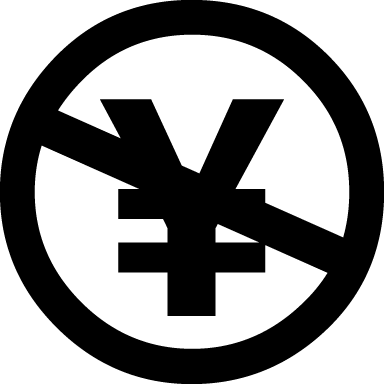
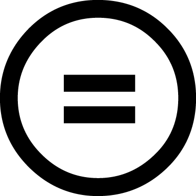

インターネットにおいて公開されている著作物には、一般的にライセンス（使用許諾）が明示されています。
著作物は、このライセンスに従って利用する必要があります。

ここでは著作権の考え方と、著作物のライセンスについて説明します。

著作権
------

著作権は、著作物を創り出した人（著作者）に与えられる権利です。著作物を作成すると自動的に発生します。
著作者の権利を保護し、公正な利用で文化を発展させることを目的とし、日本では著作権法で定められている権利です。

著作者の不利益が生じないよう、著作物は適切に利用する必要があります。

### 著作物

著作物について、著作権法では以下のように記載されています。

```
第二条　一　著作物　思想又は感情を創作的に表現したものであつて、文芸、学術、美術又は音楽の範囲に属するものをいう。
```

つまり、創作的に表現した作品であれば、小説・論文・音楽・絵画・図表・映画・写真・プログラムなど様々な形態のものが該当することが分かります。

### 著作者の権利

著作権法では、著作物を著作者の財産として守るための権利を定めています。
下記に一例を紹介します。

<dl>
<dt>複製権（第21条）</dt>
<dd>
無断で複製（コピー）されない権利
</dd>
<dt>公衆送信権（第23条）</dt>
<dd>
無断で公衆に送信されない権利
</dd>
<dt>譲渡権・貸与権（第26条）</dt>
<dd>
無断で公衆に譲渡・貸与されない権利
</dd>
</dl>

これらの権利は、著作者の知らないところで著作物が勝手に利用されることを防ぎ、著作者が本来得るべき名声や金銭を適切に得るための権利です。

### 例外的な利用

著作権法では、著作物を複製して利用する際には著作者の承認を得る必要があることが分かりました。
しかし、限定的な一部のケースでは著作者の承認を得ずに利用することができます。一例を紹介します。

* 私的使用のための複製（第30条）
* 図書館等における複製（第31条）
* 引用（第32条）

特に利用する機会が多いものは**引用**です。
引用について規定した著作権法の条文を見てみましょう。

```
第三十二条　公表された著作物は、引用して利用することができる。この場合において、その引用は、公正な慣行に合致するものであり、かつ、報道、批評、研究その他の引用の目的上正当な範囲内で行われるものでなければならない。
```

例えば、レポートや論文では自分の主張を述べる上で必要な場合に他の資料を引用することがあります。自分の主張がメインであり引用部分が明確に区別できること、かつ出所（オリジナルの著作者名や著作物名など）が明示されていることなどが必要です。

* [著作物が自由に使える場合は？ | 著作権って何？ | 著作権Q&A | 公益社団法人著作権情報センター　CRIC](http://www.cric.or.jp/qa/hajime/hajime7.html)

パブリックドメイン
------------------

パブリックドメインとは、著作権がない状態を示しています。著作権の保護期間（日本では作者の死後50年）が経過したものや、作者が著作権を放棄したものが該当します。

パブリックドメインと明記されている作品は、基本的に自由に利用することができます。


クリエイティブ・コモンズ・ライセンス
------------------------------------

パブリックドメインのように、著作権を気にせず利用できる作品は多くありません。

クリエイティブ・コモンズ・ライセンスは、[クリエイティブ・コモンズ プロジェクト](https://creativecommons.org/)が提唱する著作物を利用する際のルール（ライセンス）の一種です。４種類の条件のうち、著作物を利用する人に守ってもらいたいことを著作権者が組み合わせて明記します。この明記されたルールに沿った利用であれば、著作権者に承諾をとる必要はありません。

### CCライセンスの種類

作品を利用（再配布やリミックス作品の公開、実演等）するための条件は４種類あります。
[クリエイティブ・コモンズ・ライセンスとは](http://creativecommons.jp/licenses/) より一部抜粋して説明します。

<div class="media">
<div class="media-left">

</div>
<div class="media-body">
<h5>表示</h5>
作品のクレジットを表示すること
</div>
</div>
<div class="media">
<div class="media-left">

</div>
<div class="media-body">
<h5>非営利</h5>
営利目的での利用をしないこと
</div>
</div>
<div class="media">
<div class="media-left">

</div>
<div class="media-body">
<h5>改変禁止</h5>
元の作品を改変しないこと
</div>
</div>
<div class="media">
<div class="media-left">

</div>
<div class="media-body">
<h5>継承</h5>
元の作品と同じ組み合わせのCCライセンスで公開すること
</div>
</div>

これらを組み合わせた6種類のライセンスが存在します。表示されているアイコンに従って利用するようにしましょう。

* [Creative Commons](https://creativecommons.org/)
* [クリエイティブ・コモンズ・ジャパン](http://creativecommons.jp/)

