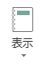
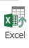
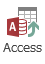

今回使うファイルです。ダウンロードしてください。
<ul>
<li><a href="../assets/Clist(fin).accdb">Clist(fin).accdb</a></li>
<li><a href="../assets/Clist.xlsx">Clist.xlsx</a></li>
<li><a href="../assets/gradetype.accdb">gradetype.accdb</a></li>
<li><a href="../assets/congress.xlsx">congress.xlsx</a></li>
<li><a href="../assets/membertype.accdb">membertype.accdb</a></li>
</ul>

Microsoft Accessについて
------------------------



Microsoft Accessは、Microsoft社が開発したリレーション（関係）型データベースソフトウェアです。
大量のデータを入力、保存することができ、そのデータを必要に応じた形で表示したり、印刷したりすることができます。

大きな特徴は、データ間のリレーションシップ（関係）に基づいて、データを処理することができるということです。

### Microsoft Excelとの違い

Microsoft Officeには、Accessの他にデータを操作するソフトウェアとしてExcelがあります。しかし、Accessはデータベースソフトウェアと呼ばれる一方で、Excelは表計算ソフトと呼ばれ、それぞれ特長を持っています。

-   Excelの特長
    -   データはセルに直接入力する
    -   自由に入力することができる
    -   計算はセルに直接計算式を入力する
    -   シートに表された形で印刷する
-   Accessの特長
    -   データはテーブルに入力する
    -   同じ列には同じ型のデータしか入力することはできない
    -   クエリを使うことによって、複数のデータテーブルを組み合わせ、様々な形で設定できる
    -   計算にはクエリを使用する
    -   レポートで任意の形で印刷することができる

Microsoft Accessの基本操作
--------------------------

### ウィンドウ構成



### クイックアクセスツールバー



よく使うコマンドを表示しておくことができます。
初期設定では、（上書き保存）、
（元に戻す）、（繰り返す）が表示されています。

をクリックすると、表示するコマンドのカスタマイズができます。

### リボン

データベースを作成していく際によく利用するコマンドを割り当てたボタンが機能ごとにパネルに分類され、配置されています。

リボン上部のタブ状になった[ホーム]、[作成]、[外部データ]、[データベース ツール]をクリックすることによって、 各機能のパネルに切り替えることができます。
もしくは、カーソルがリボン上にあるときにホイールを回すと、切り替えることができます。

-   ホーム：フォントの設定や並び替え、検索などを行う事が出来ます。



-   作成：テーブル、フォーム、レポートおよびクエリやマクロはここで作成する事が出来ます。



-   外部データ：他のAccessやExcelなどのデータをインポートしたり、ExcelやPDF形式のファイルにエクスポートしたりできます。



-   データベース ツール：マクロの設定や、リレーションシップの設定などを行う事が出来ます。



パネルの右下にある  をクリックすと、より詳しく各項目を設定することができます。





また、カーソルを使用したいコマンドの上で静止させると、そのコマンドの説明を見ることができます。

### Microsoft Accessの起動

[スタート] - [すべてのプログラム] - [Microsoft Office] - [Access 2016]をクリックします。



### データベースを開く

&#9312; [他のファイルを開く] - [開く]をクリック - 先ほど保存した"Clist(fin)"を選択 - [開く]をクリックします。





&#9313; セキュリティの警告が出ているので解除します。[コンテンツの有効化]をクリックします。



### ナビゲーションウィンドウの操作

Access2016では、ウィンドウ左に表示される"ナビゲーション ウィンドウ"を使って テーブルやフォームなどの一覧を表示させることができます。

カテゴライズの方法とフィルタの設定がここで行えます。



### テーブルを開く

ここからは、Accessの基本である「テーブル」「フォーム」「クエリ」「レポート」の開き方を見ていきます。
ナビゲーションウィンドウの各オブジェクトは名前をダブルクリックすることで開きます。

テーブルは、データを蓄積し、表として保存しておくものです。同じ行のデータはそれぞれ対応関係にあります。
列（フィールド）はデータの各項目を表しており、特定の型が設定されます。その型以外のデータは保存することはできません。

&#9312; すべてのAccessオブジェクトから[サークル名簿]を開きます。





&#9313; [ホーム]リボン（もしくは[データシート]リボン） - [表示] - （デザインビュー）をクリックしてデザインビューに切り替えます。





&#9314; デザインビューに切り替わりました。デザインビューは、テーブル以外にもあり、レイアウトの変更やフィールドの設定変更などを行うことができます。

&#9315; [ホーム]リボン（もしくは[デザイン]リボン） - [表示] - （データシートビュー）をクリックすると、元に戻ります。



### フォーム

フォームは、テーブルに保存されているデータを、また入力用のウィンドウをどのように表示するか設定するものです。
フォームを作成すると1つのレコードを1つのウィンドウに表示することができるので、入力作業を効率的に行うことができます。

&#9312; すべてのAccessオブジェクトから[会員情報]を開きます。





&#9313; [ホーム]リボン - [表示] - の（[表示]）の部分をクリックして、[デザインビュー]をクリックします。





&#9314; デザインビューに切り替わりました。[ホーム]リボン（もしくは[デザイン]リボン） - [表示] - （データシートビュー）をクリックすると、元に戻ります。



### クエリ

クエリは、テーブルに蓄積されたデータをどのような形に加工するか設定するものです。
複数のテーブルの必要な部分だけを引き出したり、関連性のあるデータ同士をリレーションシップによって接続することなどができます。

&#9312; すべてのAccessオブジェクトから[入会日と所属]を開きます。





&#9313; [ホーム]リボン - [表示] - （デザインビュー）をクリックしてデザインビューに切り替えます。





&#9314; デザインビューに切り替わりました。
[ホーム]リボン（もしくは[デザイン]リボン） - [表示] - （データシートビューもしくは[実行]）をクリックすると、元に戻ります。



### レポート

レポートは、クエリなどでデータの集合をどのようなデザインで表示するかを設定するものです。
フォームとの違いは、フォームは 1つのレコードについて各項目を表示するのに対し、レポートはデータの抽出や集計を実行した結果の報告書を作成したりできます。

&#9312; すべてのAccessオブジェクトのフォームにある[入会日リスト]を開きます。





&#9313; [ホーム]リボン - [表示] - の（表示）の部分をクリックして、[デザインビュー]に切り替えます。





&#9314; デザインビューに切り替わりました。
[ホーム]リボン（もしくは[デザイン]リボン） - [表示] - （[データシートビュー]）をクリックすると、元に戻ります。



データベースの作成
------------------

### 新しいデータベースの作成

&#9312; [ファイルメニュー] - [新規]をクリックします。



&#9313; [空のデスクトップデータベース]を選択し、ファイル名入力欄に `Clist` と入力し[作成]をクリックします。





&#9314; 新しいデータベースが作成されました。

### テーブルの作成

既にテーブルが開かれているのでこれを編集していきます。

&#9312; まず、デザインビューに切り替えます。[ホーム]リボン - [表示] - [デザインビュー]をクリックします。

&#9313; 名前を付けて保存ウィンドウが表示されるので `サークル名簿` と入力し、[OK]をクリックします。





&#9314; フィールド名の項目に以下の 11 個の要素を入力していきます。

-   会員ID（すでに `ID` と入力されている部分を `会員ID` に変更します。）
-   氏名
-   フリガナ
-   郵便番号
-   都道府県
-   市区町村
-   携帯TEL
-   入会年月日
-   学年ID
-   学部学科コース
-   退会



これでフィールド名の入力が終わりました。次に、データを入力する際に便利な機能を各フィールドに付与していきます。

### ふりがなウィザードでプロパティを設定

&#9312; "氏名"をクリック - フィールドプロパティのふりがなの項目をクリックします。横に表示された[&hellip;]というボタンをクリックします。



&#9313; 警告が出るのでテーブルを保存します。



&#9314; ふりがなウィザードの"既存のフィールドを使用する"にチェックを入れ、[フリガナ]を選択します。

&#9315; さらにふりがなの文字種に[全角カタカナ]を選択し、[完了]をクリックします。



&#9316; フィールドのプロパティを変更します。[OK]をクリックします。



これで、"氏名"のフィールドに入力すると、"フリガナ"のフィールドに全角カタカナでふりがなが入力されるようになりました。

### 住所入力支援ウィザードでプロパティを設定

&#9312; "郵便番号"をクリック - フィールドプロパティの住所入力支援の項目をクリックします。横に表示された[&hellip;]をクリックします。



&#9313; 住所入力支援ウィザードの郵便番号に[郵便番号]を選択 - [次へ]をクリックします。



&#9314; 住所の構成の中から"都道府県と住所の 2 分割"にチェック - 都道府県に[都道府県]を選択 - 住所に[市区町村]を選択 - [次へ]をクリックします。



"郵便番号"に自分の家の郵便番号を入力してみましょう。"都道府県"と"市区町村"に住所が表示されます。

&#9315; [完了]をクリックします。



&#9316; フィールドのプロパティを変更します。[OK]をクリックします。



上で試したように、これで"郵便番号"を入力すると、"都道府県"と"市区町村"に住所が入力されるようになりました。

### フィールドサイズの変更

&#9312; "学年ID"をクリック - フィールドサイズを `255` から `5` と入力し直します。



### IMEモードの変更

&#9312; "携帯TEL"をクリック - IME 入力モードを[オン]から[オフ]に変更します。



これで"携帯TEL"に入力しようとしたとき、日本語入力がオフになります。

### 定型入力プロパティの設定

&#9312; "入会年月日"の右横にある"テキスト型"を"日付/時刻型"に変更します。



&#9313; "入会年月日"をクリック - 定型入力の項目をクリック - 横に表示された[&hellip;]をクリックします。



&#9314; 警告が出るのでテーブルを保存します。



&#9315; 定型入力名の中の[日付（S）]を選択 - [次へ]をクリックします。



&#9316; さらに、[次へ] - [完了]をクリックします。





これで、"入会年月日"に入力したとき、年/月/日の形で入力されるようになりました。

### データ型の変更

&#9312; "学年ID"の右横にある"テキスト型"を"数値型"に変更します。



&#9313; 次に、"退会"の右横にある"テキスト型"を"Yes/No型"に変更します。



&#9314; "退会"をクリック - [ルックアップ]タブの"表示コントロール"を"チェックボックス"に変更します。



### データの入力

&#9312; [ホーム]リボン - [表示] - （データシートビュー）をクリックして、データシートビューに戻ります。
以下のデータを入力してみてください。

-   氏名：山本浩史（ヤマモト ヒロシ）
-   郵便番号：221-0023
-   市区町村：横浜市神奈川区宝町5-5-0
-   携帯TEL：090-5231-0000
-   入会年月日：2018/09/01
-   学年ＩＤ：1
-   学部学科コース：理学部生命科学科



### Excelデータのインポート

&#9312; まず、サークル名簿を開いていたら、"サークル名簿"タブを右クリックして閉じます。

&#9313; [外部データ]リボン - [インポートとリンク] - をクリックします。



&#9314; [参照]ボタンをクリックし、先ほどダウンロードした"Clist.xlsx"を選択します。

&#9315; "レコードのコピーを次のテーブルに追加する"にチェックを入れ、"サークル名簿"を選択し、[OK]をクリックします。



&#9316; [次へ]をクリックします。



&#9317; [完了]をクリックします。



&#9318; [閉じる]をクリックしてインポートを完了します。



このようにExcelのファイル内に保存されているデータをAccessにインポートすることができます。



### Accessテーブルのインポート

&#9312; [外部データ]タブ - [インポート] - をクリックします。



&#9313; [参照]ボタンをクリックし、先ほどダウンロードした"gradetype.accdb"を選択し、[OK]をクリックします。



&#9314; "月会費"を選択 - [OK]をクリックします。



&#9315; [閉じる]をクリックしてインポートを完了します。



"月会費"テーブルがインポートされました。



このように元々作られていたAccessのテーブルをインポートし、クエリを用いて関連づけをすることができます。

課題
----

学会の入会日リストを管理するデータベースを作成し、"会員名簿"テーブルを作成します。
テーブルのデータはExcelファイルからインポートします。以下の指示に従って、作成してください。

1. 空の"会員管理"データベースを作成してください。名称は"congress"にしてください。
2. 次のフィールドを含む"会員名簿"テーブルを作成してください。
    -   テーブル名：会員名簿
    -   フィールド名：氏名、シメイ、郵便番号、都道府県、市区町村、自宅TEL、入会年月日、会員タイプ、職種、退会
    -   フィールド名の変更：ＩＤ　→　会員ＩＤ
    -   主キー：自動的に設定される
3. "氏名"フィールドに氏名を入力すると、"シメイ"フィールドに全角カタカナのフリガナが自動的に表示されるようにしてください。
4. "郵便番号"フィールドに郵便番号を入力すると、住所が"都道府県"フィールドと"市区町村"フィールドに自動的に表示されるように設定してください。
5. "自宅TEL"フィールドのIME入力モードプロパティをオフに設定してください。
6. "入会年月日"フィールドの定型入力プロパティにデータ入力時の書式として日付（Ｓ）（年／月／日）を設定してください。
7. デザインビューで以下のフィールドを設定してください。
    -   "入会年月日"フィールドのデータ型は[日付／時刻型]
    -   "会員タイプ"フィールドのデータ型は[数値型]
    -   "退会"フィールドのデータ型は[Yes／No型]
8. "会員名簿"テーブルに、Excelファイルの"congress.xlsx"からデータをインポートしてください。
9. 新規レコードに次のデータを入力してください。
    -   会員ＩＤ：21（自動入力）
    -   氏名：佐川亮子
    -   フリガナ：サガワリョウコ（自動入力）
    -   郵便番号：160-0022
    -   都道府県：東京都（自動入力）
    -   市区町村：新宿区新宿6-6-0（自動入力だが、番地は手入力する）
    -   自宅TEL：03-3330-0000
    -   入会年月日：2014/09/26
    -   会員タイプ：2
    -   職種：大学生
    -   退会：オフ
10. "会員管理"データベースにaccessファイル"membertype.accdb"データベースの"会員タイプ"テーブルをインポートしてください。
