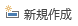

フォーム
--------

前回から引き続いて、"Clist.accdb"を使用します。開いてください。

### フォームを新規に作成する

"サークル名簿"を選択しておき、[作成]タブ - [フォーム] - [フォーム]をクリックします。





このようにフォームが作られました。上書き保存をクリックして、フォーム名に `会員情報` と名前をつけて保存しましょう。



### フォームウィザードでフォームを作成する

&#9312; [作成]タブ - [フォーム] - [フォームウィザード] をクリックします。



&#9313; テーブル/クエリを[テーブル：サークル名簿]を選択 - 以下のフィールドを選択可能なフィールドから選択したフィールドへと移します。

-   氏名
-   フリガナ
-   郵便番号
-   都道府県
-   市区町村
-   携帯TEL
-   入会年月日
-   学年ＩＤ
-   学部学科コース
-   退会

&#9314; [次へ]をクリックします。



&#9315; "単票形式"にチェックをつけたまま、[次へ]をクリックします。



&#9316; `会員入力` と入力し、"フォームを開いてデータを入力する"を選択して、[完了]をクリックします。





このようにフォームが作成されました。

### コントロールの配置とサイズ変更

&#9312; "会員入力"を開き、"デザインビュー"に切り替えます。





&#9313; 背景の境界線を、上部にある水平ルーラーの17付近まで広げます。



&#9313; "氏名"フィールドの右端を水平ルーラーの8付近まで縮めます。



&#9314; その他の項目も同様に縮めます。



&#9315; "携帯TEL"から"退会"までを選択し、右上に移動します。



&#9316; "市町村区"のテキストボックスを選択し、右に広げます。



### コントロールの追加

&#9312; [デザインビュー]に切り替えます。

&#9313; [フォームデザインツール] - [デザイン] - [コントロール] - [ラベル]をクリック - "フォーム ヘッダー"のセクション内で任意の範囲を選択し、ラベルコントロールを追加します。



&#9314; ラベルコントロール内に"サークル名簿への入力"と入力 - [Enter]キーをクリックして、確定します。



&#9315; "サークル名簿への入力"と入力したラベルコントロールを右クリックします。"プロパティ"をクリックし、"プロパティシート"を開きます。[書式]タブの"フォントサイズ"を `10` に変更します。

&#9316; ラベルコントロールの大きさを適当に調節します。



&#9317; フォームビューに戻り、上書き保存してください。

### フォームで新しいレコードを入力

&#9312; レコードの  をクリックします。



&#9313; 以下のデータを入力してください。

-   氏名：朝倉紗希
-   郵便番号：154-0023
-   市区町村：世田谷区若林4-42-0
-   携帯TEL：090-5837-0000
-   入会年月日：2017/09/27
-   学年ＩＤ：2
-   学部学科コース：理学部数理科学科



&#9314; 会員入力フォームを閉じて、サークル名簿を開きます。



課題
----

"congress"の"会員名簿"テーブルを基に次の指示に従ってフォームを作成してください。

1. "会員名簿"テーブルを基に、[フォーム]を使って単票形式のフォームを作成してください。作成したフォームに"会員情報"という名前を付けて保存してください。
2. "会員情報"フォームを閉じます。
3. "会員名簿"テーブルを基に、[フォームウィザード]を使って、以下のような単票形式のフォームを作成してください。
    -   表示するフィールド：会員ＩＤを除く全て
    -   フォーム名：会員入力
4. 全てのフィールドのサイズを縮めます。位置の目安は水平ルーラーの目盛りの"9"にしてください。
5. "自宅TEL"、"入会年月日"、"会員タイプ"、"職種"、"退会"を他のフィールドの横に動かしてください。位置の目安は水平ルーラーの目盛りの"10"にしてください。
6. "市区町村"のテキストボックスのサイズを広げる。位置の目安は水平ルーラーの目盛りの"11"にしてください。
7. タイトルの下に `会員名簿への入力` というラベルを追加してください。フォントサイズは `10` ポイントに変更します。
8. フォームを上書き保存し、"会員入力"フォームを閉じます。
