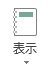

リレーションシップ
------------------

リレーションシップとは、Access の最大の特徴です。
リレーションシップ（relationship）は関係を意味する英単語です。その名の通り、テーブルとテーブルを関係づけることができます。

#### 1つのテーブルで管理する場合

-   "学年ＩＤ"、"学年"、"月会費"に何度も同じデータを入力しなければなりません。
-   "学年"や"月会費"に変更があると、全部の名称や金額を修正する必要があります。



#### 2つのテーブルに分けて管理する場合

-   何度もデータを入力しなくて良いので、入力ミスが防げます。
-   "学年"や"月会費"が変更されても、"種類マスター"テーブルでそれぞれ 1 カ所ずつ修正すれば大丈夫です。



前回から引き続いて、"Clist.accdb"を使用します。開いてください。

### リレーションシップを作成する

&#9312; "サークル名簿"テーブルと"月会費"テーブルを使って、"学年ID"フィールドにリレーションシップを作成します。

&#9313; [データベース ツール]タブ - [リレーションシップ] - [リレーションシップ]をクリックします。



&#9314; テーブルタブから"サークル名簿"と"月会費"を選択 - [追加]をクリックします。

&#9315; "サークル名簿"と"月会費"がリレーションシップウィンドウに追加されたら、[閉じる]をクリックします。





&#9316; "サークル名簿"の"学年ID"を"月会費"の"学年ID"にドラッグアンドドロップします。



&#9317; すると、リレーションシップの作成ウィンドウが現れるので、[作成]をクリックします。





"学年ID"同士が線で繋がりました。これがリレーションシップが作成された証です。上書き保存し、一旦閉じます。

### クエリでテーブルを結合する

&#9312; [作成]タブ - [クエリ] - [クエリデザイン]をクリックします。



&#9313; "サークル名簿"と"月会費"を選択 - [追加]をクリックして、追加した後に[閉じる]をクリックします。



先ほど繋いだリレーションシップが表示されています。
&#9314; 以下のフィールドを"サークル名簿"と"月会費"からそれぞれ追加します。

-   サークル名簿：会員ＩＤ
-   サークル名簿：氏名
-   サークル名簿：学年ＩＤ
-   月会費：学年
-   サークル名簿：学部学科コース
-   サークル名簿：退会
-   月会費：月会費



&#9315;  ([表示])もしくは  ([実行])をクリックします。



&#9316; "朝倉紗希"の"学年ＩＤ"の値を `2` から `1` に変更 - [Enter]をクリックします。





"学年"が `学部１年` に変更され、また"月会費"も `&yen;500` に変更されました。
これはリレーションシップによって、"サークル名簿"の"学年ＩＤ"と"月会費"の"学年ＩＤ"が関連づけられたことによって、
"サークル名簿"の"学年ＩＤ"を変えたことにともなって、"月会費"で対応する"タイプ"が呼び出されたということになります。

&#9317; "朝倉紗希"の"学年ＩＤ"の値を `1` から `2` に戻します。



&#9318; "会員管理"という名前で[名前を付けて保存]してください。

### 演算フィールド

&#9312; "デザインビュー"に切り替えます。

&#9313; "月会費"フィールドの右隣に `請求金額:[月会費]*12` と入力し、[Enter]をクリックします。



&#9314; "退会"フィールドの抽出条件に `no` と入力し、[Enter]をクリックします。



&#9315;  ([表示])もしくは  ([実行])をクリックします。



&#9316; "請求金額"が年額になったことと"退会"していない会員だけが表示されていることを確認してください。

&#9317; "請求管理"という名前で[名前を付けて保存]してください。

### 複数のテーブルから作成したクエリを基にしたレポートの作成

グループ集計レポートの作成

&#9312; [作成]タブ - [レポート] - [レポート ウィザード]をクリックします。



&#9313; "クエリ:請求管理"を指定し、以下のフィールドを選択可能なフィールドから選択したフィールドに移動させてください。

-   会員ＩＤ
-   氏名
-   学年
-   月会費
-   請求金額

&#9314; [次へ]をクリックします。



&#9315; "byサークル名簿"を選択 - [次へ]をクリックします。



&#9316; "学年"を選択 - [＞]をクリックして右側へ移動 - [次へ]をクリックします。



&#9317; [集計のオプション]をクリックします。



&#9318; "月会費"と"請求金額"フィールドの"合計"をチェック - "詳細および集計値"を選択 - [OK]をクリックします。



&#9319; [次へ]をクリックします。



&#9320; 好きなスタイルを選択 - "縦"を選択 - [次へ]をクリックします。



&#9321; `学年別集計` と入力 - "レポートをプレビューする"にチェック - [完了]をクリックします。



このように学年別の集計表ができました。



### コントロールプロパティの変更：通貨記号の表示

&#9312; "デザインビュー"に切り替えます。

&#9313; 詳細セクションの"請求金額"、学年フッターセクションの 2つの"=Sum"、レポートフッターセクションの 2つの"=Sum"の合計 5 箇所を選択します。

&#9314; "プロパティシート" - [書式]タブ - 書式の[通貨]を選択します。



&#9315;  ([表示])をクリックします。



### コントロールの配置とサイズ変更

よく見てみると、"請求金額"の合計の部分の表示がおかしいことに気付きます。最後にここを直してみましょう。



&#9312; デザインビュー"に切り替えます。

&#9313; ページヘッダーセクションと詳細セクションの"月会費"と"請求金額"、学年セクションとレポートフッターセクションの"=Sum"を、後で項目が縦に揃うように移動します。その際、詳細セクションの"氏名"の右側も合わせて縮めます。



&#9314; 詳細セクションの"請求金額"、学年セクションとレポートフッターセクションの右側の"=Sum"を右に少し広げます。



&#9315;  ([表示])をクリックします。



これで、正しく金額が表示されるようになりました。上書き保存してください。

課題
----

"congress"の"会員名簿"テーブルを基に次の指示に従ってクエリを作成し、並べ替えや条件の設定を行ってください。

1. "会員名簿"テーブルと"会員管理"テーブルの"会員タイプ"フィールドにリレーションシップを作成してください。
2. "会員名簿"テーブルと"会員管理"テーブルを基に、デザインビューでクエリを作成してください。次のテーブルからフィールドを追加してください。
    -   会員名簿：会員ID
    -   会員名簿：氏名
    -   会員名簿：会員タイプ
    -   会員名簿：職種
    -   会員名簿：退会
    -   会員タイプ：会費
3. "会費"フィールドの右に"年会費"フィールドを作成して、会費を12倍して、年額にした金額を表示してください。
4. 作成したクエリを実行してください。
5. 作成したクエリを"請求管理"という名前を付けて保存してください。
6. "請求管理"クエリを閉じてください。
7. "請求管理"クエリを基に、レポートウィザードを使って、職種ごとの年会費を集計するレポートを作成してください。
    -   表示するフィールド："会員ID"、"氏名"、"職種"、"年会費"
    -   グループレベル：職種
    -   レポート名：職種別集計 
8. "職種別集計"レポートの"年会費"とグループごとの小計と総計に通貨記号を表示し、しっかりと表示されるように枠を拡大して上書き保存してください。
9. "職種別集計"レポートを閉じます。
