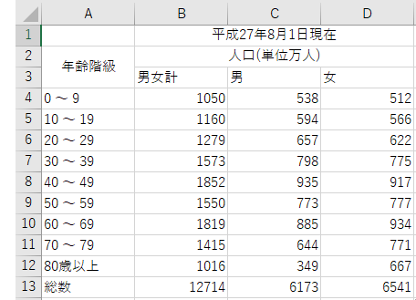
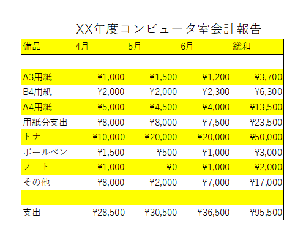

Microsoft Excelの起動
---------------------

1.  [スタート] をクリックします
1.  [すべてのプログラム] - [Microsoft Office] - [Excel 2016]をクリックします

ブックの作成と保存
------------------

### ブックの作成

####  新規作成

1.   をクリックします
1.   -  をクリックします

#### 既存ブックのオープン（改訂、再編集）

1.   をクリックします
1.   -  - 目的のブックのあるフォルダに移動します
1.  目的のファイルのアイコン  をダブルクリック、または選択して開きます

あるいは、目的の文書のあるフォルダに移動し、そのアイコンをダブルクリックします。

### ブックの保存

全てのアプリケーションに共通することですが、様々なトラブルにより制作途中のデータが失われてしまうことがあります。それを防ぐためにも、**こまめに保存する**ように心がけましょう。

#### 初めてブックを保存する

1.   をクリックします
1.   -  の順にクリックします
1.  必要な保存形式を選択 - 保存したいフォルダに移動します
1.  ファイル名を入力し [Enter] キーを押します。もしくは [保存] をクリックします

保存形式は [名前を付けて保存] のウィンドウで [ファイルの種類] から選択することもできます。



<dl>
<dt>Excel ブック(.xlsx)</dt><dd>Excel 2007 以降で利用できる標準形式で保存します。</dd>
<dt>Excel マクロ有効ブック</dt><dd>Excelで使えるマクロを有効にしたブックです。xlsm形式で保存されます。</dd>
<dt>Excel バイナリ ブック</dt><dd>ブックの読み込み、保存をすばやく行えるように最適化した形式で保存します。</dd>
<dt>Excel 97-2003 ブック(.xls)</dt><dd>Microsoft Excel 97 から Excel 2003 までで標準利用されていた形式で保存します。</dd>
<dt>OpenDocument スプレッドシート(.ods)</dt><dd>Microsoft Office 以外のオフィス製品でも利用できる、オフィススイートの共通形式で保存します。</dd>
<dt>PDF(.pdf)</dt><dd>PDF形式で保存します。Excel がインストールされていない環境でも、PDF に対応するソフトウェアがあれば開くことができます。</dd>
</dl>

#### 既存のブックの変更を保存する

1.   をクリックします
1.   をクリックします

あるいは、クイックアクセスツールバーの  をクリックします。

### Excel の終了

1.   をクリックします
1.  [閉じる] をクリックします

Microsoft Excel 2016の概要
--------------------------

### このアプリケーションで何ができるか?

-   簡単な操作による作表や表に入力されたデータの集計計算
-   書式の設定による表の効果的な視覚化
    -   見た目を整える
-   豊富な計算機能
    -   関数を使った計算
    -   シミュレーションも可能
-   グラフの作成によるデータの視覚化

### ウィンドウ構成



### クイックアクセスツールバー

よく使うコマンドを表示しておくことができます。



初期設定で表示されているアイコンとその機能は以下の通りです。

-    [上書き保存]
-    [元に戻す]
-    [繰り返す]

 を押すと、表示するアイコンのカスタマイズができます。

### リボン

ブックを作成していく際によく利用するコマンドを割り当てたボタンが機能ごとにパネルに分類され、配置されています。

リボン上部のタブ状になった[ホーム]、[挿入]、[ページレイアウト]、[数式]、[データ]、[校閲]、[表示]をクリックすることによって、各機能のパネルに切り替えることができます。もしくは、カーソルがリボン上にあるときにホイールを回すと、切り替えることができます。

#### ホーム

主に文字やセルの装飾、切り貼り、編集などの基本的なコマンドが収納されています。



#### 挿入

表や図、グラフ、ヘッダーとフッターなどを挿入します。



#### ページレイアウト

ページのレイアウト、見やすさを設定します。



#### 数式

セルにSUMやAVERAGEなどの関数を挿入したり、ワークシートの分析を行うことができます。



#### データ

データの形式を変換したり、並び替えやフィルタを適用したりと、データを扱う事が出来ます。



#### 校閲

スペルチェックや文字カウント、コメントの挿入などできあがった文書を校正したり、また、訂正した部分の比較などを行うことができます。



#### 表示

Excelの画面での表示の仕方を設定します。



パネルの右下にある  を押すと、より詳しく各項目を設定することができます。





また、カーソルを使用したいコマンドの上で静止させると、そのコマンドの説明を見ることができます。

表作成の基本知識
----------------

### 表の行と列

表計算ソフトとは、表の行、列を使って情報を整理していくものです。
縦、横に連なるデータをまとめ上げ計算し、新たな情報を生み出そうとするものです。
そのために表計算の単位であるセルを理解し、セルの所属する行、列の概念を理解しなければなりません。

Wordのようなワープロソフトとは違い、縦横細かく仕切られた空(から)の表が新規書類として表れます。この1枚を *ワークシート* と呼びます。
一番左には *行* ラベルの数字、一番上には *列* ラベルのアルファベットが書かれています。
各四角を *セル* と呼びます。現在操作の対象となるセルを *現行(アクティブ)セル* といいます。
あるセルをアクティブにするにはそのセルをクリックします。
アクティブセルは太線でセルが囲まれていると同時にその *セル名(アドレス)* が一番左上の *名前ボックス* に [列ラベル行ラベル] で表示されています。

複数のワークシートを１つのブックに作成できます。初期設定ではその数は1枚です。



ワークシートの数は増やしたり減らしたりできます。後で述べる数値処理では行、列の２項目のみでなく他のワークシートのデータとの計算も行えるので、３項目での計算が可能となります。

### データの入力



名前ボックスの右側の行が *データ入力バー* となります。
まず *取消ボタン* " と *入力ボタン*  の入った枠があり、その右に現在のアクティブセルの内容(データ)が表示されています。

データを入力するには

1.  入力するセルを選択します。(そのセルをクリックします)
2.  データ入力バーのテキストボックスにデータを入力します。
3.  入力の確定は [return]、[tab]、[Enter]、矢印キーを押します。または,
    別のセルをクリックするか、をクリックします。
4.  入力の取消はをクリックします。

セルに入力されるデータにはいくつかの形式があります。この形式の違いによって、Excel内での処理も変わるので注意しましょう。
データの形式を変えるには、"ホーム"リボン内の"数値"パネルを使います。下の画像にあるプルダウンメニューを使って形式を変更できます。



通常、データの形式は"標準"であれば、自動的に適した形式で認識してくれます。特定の形式で入力したい場合は以下のように行います。

#### 数値の入力

-   **計算機能の元データとなる**数値入力は **半角** で
-   カンマで3桁を区切ると自動的に記号なし通貨スタイル `12,345`
-   `\12345` と入力すると記号つき通貨スタイル
-   `%12.345` と入力するとパーセント表示形式



#### 日付時刻入力

-   2つ以上の数字を `/` あるいは `-` で分けると日付
-   `H15.4.14` (H (または S, T, M) の直後に数字をピリオド分かち) で和暦
-   時刻は `:` で数字を分ける



#### 文字データの入力



#### 数値と文字列の見分け方

Excelは、セルに入力した際に、それが**数値**なのか**文字列**なのかを自動で判断します。
実際の表示は、先ほどまでの説明で使われている画像を参照して下さい。

-   数値の場合：右揃え
-   文字列の場合：左揃え

#### データカーソル

表内をセルからセルへ移動したりデータの入力を素早く、煩わしくなくさせるための手段があります。

<table>
<thead>
<tr>
<th>キー操作</th><th>内容</th>
</tr>
</thead>
<tbody>
<tr>
<td>アルファベット側の [Enter]</td><td>1つ下のセルへ移動</td>
</tr><tr>
<td>[Tab]</td><td>1つ右のセルへ移動</td>
</tr><tr>
<td>矢印キー [&rarr;] [&darr;] [&uarr;] [&larr;]</td><td>指定された矢印の方向へ1つセル移動</td>
</tr>
</tbody>
</table>



#### 複数セルの選択、編集

以下のことを実際に行ってください。

-   複数セルの選択、コピー、ペースト
    -   複数セル選択後、[ホーム]リボン - [クリップボート]タブ - [切り取り]、[コピー]、[貼り付け]
    -   あるいは右ボタンクリックによるポップアップメニュー [切り取り]、[コピー]、[貼り付け]
-   複数セルのデータの消去
    -   複数セル選択後、[ホーム]リボン - [編集]タブ - 
    -   あるいは右ボタンクリック - [数式と値のクリア]
-   行、列の挿入、削除

人口統計表の作成
----------------

人口統計表を作成してみましょう。
最終的に以下の表となるものを作っていきます。元となるデータは[総務省統計局](http://www.stat.go.jp/)から引用しました。

-   [人口推計月報（平成28年2月）](http://www.e-stat.go.jp/SG1/estat/Xlsdl.do?sinfid=000031373513)

完成形

### データの入力

まず以下のようにデータを入力して後に形式、足りない数値を整えましょう。
数字のみのところは**半角**で、またデータがセル幅を越えてしまうのも気にしなくて大丈夫です。（あとで修正します）



### セルの調整

まずは、セル幅(高)の調節を行います。

&#9312; 幅を変えたい列の列番号をクリックします。

&#9313; ポインタをその列番号の右端におき、ドラッグして幅を調節します。



&#9314; 複数行同時も可能です。[shift]キーを押して複数列をクリックして、どの列でもいいのでドラッグして幅を調節します。



&#9315; 高さも同様に行います。



今は列A、B、C、Dの幅を150ピクセル程度に拡げておきましょう。

次は、セルの結合と文字配置の変更を行います。
セル "B1" から "D1" 、"B2" から "D2" までをそれぞれを結合させて一つのセルとします。

&#9312; まず "B1" から "D1" をアクティブセルとして選択します。

&#9313; 次に[ホーム]リボン - [配置]パネル内の[セルを結合して中央揃え]をクリックします。



&#9314; また、[ホーム]リボン - [配置]パネル内の右下にある から詳細に設定することもできます。



&#9315; 今回は、"縦位置"と"横位置"を中央揃えにし、"セルを結合する"チェックボックスにチェックをします。



"B2" から "D2" も同様にセルを結合します。同様にして、縦方向にセルも結合できます。"A2" から "A3" を結合させましょう。

ここまでで以下のようになっているはずです。



### 数式処理

数式処理はセルの先頭が（半角の）`=` で始まります。これをセルに直接入力、もしくは数式バーから入力します。



Excelで用いる主な算術演算子は以下のようなものがあります。

-   `+` : 加算
-   `-` : 減算
-   `*` : 乗算
-   `/` : 除算
-   `^` : べき乗
-   `%` : パーセント

演算の優先順位は、基本的には通常通りですが、括弧 `()` を用いることもできます。また、これ以外にも多くの関数による演算が可能です。



### オートフィルによる自動繰り返し計算



各年齢階級での男女計の計算を行ってみましょう。

たとえば "B4" は `=C4+D4` となるので、"B4" をアクティブセルにして `=C4+D4` と**半角で**入力します。データの先頭が半角で `=` の場合、自動的に数式処理モードになります。



同種の計算を `B5` から `B13` までしてみましょう。そのため `B4` のアクティブセル右下の黒い小さな四角（フィルハンドル）をマウスでポイントします。左ボタンを押した状態でセル囲みの四角を下に `B13` までドラッグします。



このようにして、入力を省略することができます。この機能が**オートフィル**です。

-   [セルの相対参照・絶対参照について](../02/index.html)

### 総和計算



続いて男、女の総計(Sum)を "C13"、"D13" に計算していれます。"C13"を選択し、以下に示すような[オート SUM]ボタンをクリックします。



総和が "C13" に自動的にはいります。女のデータも同様に行いましょう。これで男女の総計も計算されます。





### 保存と終了

マイドキュメントに、ファイル名を `rensyu` として保存しましょう。Excelは拡張子 `.xlsx` を自動的に補ってくれます。

課題 1
-----

人口統計表を仕上げてください。

1.  "E3" にタイトル `男女差` と入力、"E4" から "E13" まで対応する年代の男女の人口の差を計算してデータを埋めてください
1.  "F3" を `男女比` として各年代の 女性人口 &divide; 男性人口 を計算してください
    -   除算記号は `/` (スラッシュ) です
    -   データの形式を変えるには、"ホーム"リボン内の"数値"パネルを使うと、パーセント表示にすることも出来ます

表を整える
----------

同じようなものですが、多少変わった視点から表作りをしましょう。
四則演算や総和、オートフィルも再び練習します。
人口統計表の作成と重複する部分もありますが、何回も練習・確認することにより技術を磨きましょう。

以下の表を前回作った `rensyu.xlsx` の `Sheet2` に入力しますが、その前にセルの表示形式を設定します。



### セルの表示形式（通貨スタイル）

ここでデータ入力前にセル "B3" から "E12" までの書式を通貨としましょう。操作は以下の通りです。

1.  "B3" から "E12" までをドラッグし、選択します
2.  [ホーム]リボン内の[数値]パネルの `標準` を `通貨` に変更します

この書式を設定した後に、上の画像のデータを入力します。
ただし、`\1,000` と入力せずに、単に `1000` と入力してください。
先ほどの設定によって、[表示形式]が `通貨` になっているため、Excelが自動的に通貨記号とカンマを補います。

入力が終わったら、集計計算を行います。簡単な整頓を行って、表を完成させましょう。

1.  "A6" に `用紙分支出` と入力します
2.  4月の用紙消費金額を数式処理で求めて、"B6" に入れます
3.  4月の支出総額を数式処理で求めて、"B12" に入れます
4.  5月の用紙消費金額と支出総額をそれぞれ "C6" 、 "C12" にオートフィルで求めて、入れます
5.  "D1" に `6月` と入力します
6.  6月の用紙消費金額と支出総額をそれぞれ "D6" 、 "D12" にオートフィルで求めて、入れます（各備品の支出額はまだ空欄のままでよい）
7.  "E3" から "E10" まで、及び "E12" を各項目の4月から6月の総和として処理します
8.  6月の各項目に適当な数字を入力し、その総和と数式処理のセルがその入力値に従って変化することを確認してください

### 表の表示の工夫

表の表示を工夫して、Excelで作った表を表計算のためのものだけでなく、レポート用、プレゼン用に利用することもできます。

#### 行や列のサイズの変更

前述のセルの調整でも行えますが、ここでは別の方法を紹介します。

&#9312; サイズ変更すべき行あるいは列全体を選択（行頭、列頭ラベルをクリックします）します。

&#9313; "ホーム"リボン内の"セル"パネルの[書式] - [行の高さ]もしくは[書式] - [列の幅]を選択します。



&#9314; ダイアログに現在の値が表示されます。調整したい値を入力します。

&#9315; "ホーム"リボン内の"配置"パネルで文字の配置を設定します。





#### 罫線の挿入

行、列の点線を実（点）線で囲みます。

&#9312; [ホーム]リボン内の[フォント]パネル内の右下にある  をクリックします。



&#9313; 表示されたウィンドウの上部にある[罫線]タブをクリックします。ここで詳細な設定が可能です。



&#9314; [ホーム]リボン内の[フォント]パネルでもある程度設定可能です。



#### フォントの変更

&#9312; [ホーム]リボン内の[フォント]パネル内の右下にある  をクリックします。





&#9313; [ホーム]リボン内の[フォント]パネルでも選択可能です。



#### セルの配色





&#9312; [ホーム]リボン内の[フォント]パネル内の右下にある をクリックします。



&#9313; [塗りつぶし]を選択します。ここでセルの背景の設定が出来ます。



&#9314; [ホーム]リボン内の[フォント]パネルでも指定することができます。



#### 印刷範囲

まず、印刷したい範囲を選択します（セル、行、列の選択）。
例えば上の例では "A1" から "E12" までを選択します。[ページレイアウト]リボン内の[ページ設定]パネル内の[印刷範囲] - [印刷範囲の設定]をクリックします。

#### 印刷プレビュー

実際に印刷する前に、刷り上がりの確認を取ります。
 - [印刷] で表示されます。

#### 印刷

実際に印刷します。
 - [印刷] で表示されたプレビューを確認した上で、印刷ボタンをクリックします。

<strong>情報処理教室における制約事項</strong>

情報処理教室では、カラー印刷を行うことはできません。

### 実際の表示工夫例

以下は先ほど作った表の印刷プレビューです。印刷範囲は "A1" から "D12" です。表示工夫は何もしていません。



これでも十分ですが、さらに工夫した方が見やすくなります。

&#9312; まずタイトルを入れます。

-   1 行目全体をクリックして、選択します
-   右クリックをして[挿入]で行を挿入します
-   "B1" に `XX年度コンピュータ室会計報告` と入力します
-   "B1" の文字列を `16pt` の大きさに変更します

&#9313; さらに罫線を引いたり、行や列、文字に色を付けます。

課題 2
-----

上のコンピュータ室会計報告を工夫して、綺麗で見やすいものにしてください。

