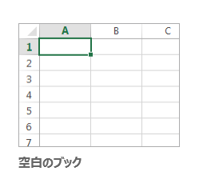

Microsoft Excel 2016の概要
--------------------------

Excel は表計算ソフトウェアと呼ばれる種類のアプリケーションソフトウェアです。
以下の作業を行うことに向いています。

-   簡単な操作による作表や表に入力されたデータの集計計算
-   書式の設定による表の効果的な視覚化
    -   見た目を整える
-   豊富な計算機能
    -   関数を使った計算
    -   シミュレーションも可能
-   グラフの作成によるデータの視覚化

### Excel の起動

1.  [スタート] をクリックします
1.  [すべてのプログラム] - [Microsoft Office] - [Excel 2016]をクリックします

### ウィンドウ構成

Excel の画面は以下のようになっています。



#### クイックアクセスツールバー

よく使うコマンドを表示しておくことができます。



初期設定で表示されているアイコンとその機能は以下の通りです。

-    [上書き保存]
-    [元に戻す]
-    [繰り返す]

 を押すと、表示するアイコンのカスタマイズができます。

#### リボン

ブックを作成していく際によく利用するコマンドを割り当てたボタンが機能ごとにパネルに分類され、配置されています。

リボン上部のタブ状になった[ホーム]、[挿入]、[ページレイアウト]、[数式]、[データ]、[校閲]、[表示]をクリックすることによって、各機能のパネルに切り替えることができます。もしくは、カーソルがリボン上にあるときにホイールを回すと、切り替えることができます。

##### ホーム

主に文字やセルの装飾、切り貼り、編集などの基本的なコマンドが収納されています。



##### 挿入

表や図、グラフ、ヘッダーとフッターなどを挿入します。



##### ページレイアウト

ページのレイアウト、見やすさを設定します。



##### 数式

セルにSUMやAVERAGEなどの関数を挿入したり、ワークシートの分析を行うことができます。



##### データ

データの形式を変換したり、並び替えやフィルタを適用したりと、データを扱う事が出来ます。



##### 校閲

スペルチェックや文字カウント、コメントの挿入などできあがった文書を校正したり、また、訂正した部分の比較などを行うことができます。



##### 表示

Excelの画面での表示の仕方を設定します。



パネルの右下にある  を押すと、より詳しく各項目を設定することができます。





また、カーソルを使用したいコマンドの上で静止させると、そのコマンドの説明を見ることができます。

### ブックの作成

Excel では、作業したデータを "ブック" と呼びます。

####  新規作成

1.   をクリックします
1.   -  をクリックします

#### 既存ブックのオープン（改訂、再編集）

1.   をクリックします
1.   -  - 目的のブックのあるフォルダに移動します
1.  目的のファイルのアイコン  をダブルクリック、または選択して開きます

あるいは、目的の文書のあるフォルダに移動し、そのアイコンをダブルクリックします。

### ブックの保存

全てのアプリケーションに共通することですが、様々なトラブルにより制作途中のデータが失われてしまうことがあります。それを防ぐためにも、**こまめに保存する**ように心がけましょう。

#### 初めてブックを保存する

1.   をクリックします
1.   -  の順にクリックします
1.  必要な保存形式を選択 - 保存したいフォルダに移動します
1.  ファイル名を入力し [Enter] キーを押します。もしくは [保存] をクリックします

保存形式は [名前を付けて保存] のウィンドウで [ファイルの種類] から選択することもできます。



<dl>
<dt>Excel ブック(.xlsx)</dt><dd>Excel 2007 以降で利用できる標準形式で保存します。</dd>
<dt>Excel マクロ有効ブック</dt><dd>Excelで使えるマクロ（簡単なプログラム）を有効にしたブックです。xlsm形式で保存されます。</dd>
<dt>Excel バイナリ ブック</dt><dd>ブックの読み込み、保存をすばやく行えるように最適化した形式で保存します。</dd>
<dt>Excel 97-2003 ブック(.xls)</dt><dd>Microsoft Excel 97 から Excel 2003 までで標準利用されていた形式で保存します。</dd>
<dt>OpenDocument スプレッドシート(.ods)</dt><dd>Microsoft Office 以外のオフィス製品でも利用できる、オフィススイートの共通形式で保存します。</dd>
<dt>PDF(.pdf)</dt><dd>PDF形式で保存します。Excel がインストールされていない環境でも、PDF に対応するソフトウェアがあれば開くことができます。</dd>
</dl>

#### 既存のブックの変更を保存する

1.   をクリックします
1.   をクリックします

あるいは、クイックアクセスツールバーの  をクリックします。

### Excel の終了

1.   をクリックします
1.  [閉じる] をクリックします

ワークシートの操作
----------------

ブックには、複数の **ワークシート** を作成できます。新規作成時のワークシートは1枚です。



ワークシートの数は増やしたり減らしたりできます。
後で述べる数値処理では行、列の２項目のみでなく他のワークシートのデータとの計算も行えるので、３項目での計算が可能となります。

### ワークシートの追加

画面下部のタブの右にある + マークをクリックします。
ワークシートの名前を変更する場合は、タブを右クリックして [名前の変更] を選択します。

### ワークシートの削除

削除するワークシートのタブを右クリックし、 [削除] を選択します。

セルの操作
---------

### 行と列

表計算ソフトでは、表の行・列を使って情報を整理していきます。
これにより縦・横に連なるデータをまとめ上げ計算し、新たな情報を生み出すことができます。
そのために表計算の単位であるセルを理解し、セルの所属する行、列の概念を理解しなければなりません。

ワークシートの左には **行** ラベルの数字、上には **列** ラベルのアルファベットが書かれています。
各四角を *セル* と呼びます。現在操作の対象となるセルを **アクティブ（現行）セル** といいます。
任意のセルをアクティブにするには、そのセルをクリックします。
アクティブセルは緑色の太線で囲まれた状態で表示され、画面左上の **名前ボックス** に **アドレス（セルの名前）** が表示されます。

### データの入力



名前ボックスの右側のテキストボックスは **数式バー** です。
キャンセルボタン  と 入力ボタン  の入った枠があり、その右に現在のアクティブセルの内容（データ）が表示されています。

データの入力は、以下の手順で行います。

1.  入力するセルを選択します。(そのセルをクリックします)
2.  データ入力バーのテキストボックスにデータを入力します。
3.  入力の確定は [return]、[tab]、[Enter]、矢印キーを押します。または別のセルをクリックするか、をクリックします。
4.  入力の取消は  をクリックします。

セルに入力されるデータにはいくつかの形式があります。この形式の違いによって、Excel内での処理も変わるので注意しましょう。
データの形式を変えるには、"ホーム"リボン内の"数値"パネルを使います。下の画像にあるプルダウンメニューを使って形式を変更できます。



#### 数値の入力

通常、データの形式は"標準"であれば、自動的に適した形式で認識してくれます。特定の形式で入力したい場合は以下のように行います。
なお、**計算機能の元データとなる数値の入力は 半角 でおこないます**。

-   カンマで3桁を区切ると自動的に記号なし通貨スタイル `12,345`
-   `¥12345` と入力すると記号つき通貨スタイル
-   `%12.345` と入力するとパーセント表示形式



#### 日付や時刻の入力

-   2つ以上の数字を `/` あるいは `-` で分けると日付
-   `H15.4.14` (H (または S, T, M) の直後に数字をピリオド分かち) で和暦
-   時刻は `:` で数字を分ける



#### 文字データの入力



#### 数値と文字列の見分け方

Excelは、セルに入力した際に、それが**数値**なのか**文字列**なのかを自動で判断します。
実際の表示は、先ほどまでの説明で使われている画像を参照して下さい。

-   数値の場合：右揃え
-   文字列の場合：左揃え

#### データカーソル

表内をセルからセルへ移動したりデータの入力を素早く、煩わしくなくさせるための手段があります。

<table>
<thead>
<tr>
<th>キー操作</th><th>内容</th>
</tr>
</thead>
<tbody>
<tr>
<td>アルファベット側の [Enter]</td><td>1つ下のセルへ移動</td>
</tr><tr>
<td>[Tab]</td><td>1つ右のセルへ移動</td>
</tr><tr>
<td>矢印キー [&rarr;] [&darr;] [&uarr;] [&larr;]</td><td>指定された矢印の方向へ1つセル移動</td>
</tr>
</tbody>
</table>



#### 複数セルの選択、編集

以下のことを実際に行ってください。

-   複数セルの選択、コピー、ペースト
    -   複数セル選択後、[ホーム]リボン - [クリップボート]タブ - [切り取り]、[コピー]、[貼り付け]
    -   あるいは右ボタンクリックによるポップアップメニュー [切り取り]、[コピー]、[貼り付け]
-   複数セルのデータの消去
    -   複数セル選択後、[ホーム]リボン - [編集]タブ - 
    -   あるいは右ボタンクリック - [数式と値のクリア]
-   行、列の挿入、削除

人口統計表の作成
--------------

人口統計表を作成してみましょう。
最終的に以下の表となるものを作っていきます。元となるデータは[総務省統計局](http://www.stat.go.jp/)から引用しました。

-   [人口推計月報（平成28年2月）](http://www.e-stat.go.jp/SG1/estat/Xlsdl.do?sinfid=000031373513)



### データの入力

まず以下のようにデータを入力して後に形式、足りない数値を整えましょう。
数字のみのところは **半角** で入力します。
データがセル幅を越えてしまうこともありますが、あとで修正するため今はそのままとしておきます。



### セルの調整

#### 幅・高さの調整

まずは、セルの幅・セルの高さの調節を行います。

1. 幅を変えたい列の列番号をクリックします。
2. ポインタをその列番号の右端におき、ドラッグして幅を調節します。

3. 複数行同時も可能です。[shift]キーを押して複数列をクリックして、どの列でもいいのでドラッグして幅を調節します。

4. 高さも同様に行います。


今は列A、B、C、Dの幅を150ピクセル程度に拡げておきましょう。

#### セルの結合と文字配置

次は、セルの結合と文字配置の変更を行います。
セル "B1" から "D1" 、"B2" から "D2" までをそれぞれを結合させて一つのセルとします。

1. まず "B1" から "D1" をアクティブセルとして選択します。
2. 次に[ホーム]リボン - [配置]パネル内の[セルを結合して中央揃え]をクリックします。

3. また、[ホーム]リボン - [配置]パネル内の右下にある から詳細に設定することもできます。

4. 今回は、"縦位置"と"横位置"を中央揃えにし、"セルを結合する"チェックボックスにチェックをします。

5. "B2" から "D2" も同様にセルを結合します。同様にして、縦方向にセルも結合できます。"A2" から "A3" を結合させましょう。

ここまでで以下のようになっているはずです。



### オートフィルによる自動繰り返し計算

各年齢階級での男女計の計算を行ってみましょう。
計算については次項で改めて説明しますが、ここでは足し算をします。

たとえば "B4" に表示される数値は、 "C4" と "D4" の和となります。これを式で表現すると、`C4+D4` となります。
Excel では、セルの値が半角イコール `=` から始まる場合、その式が計算され結果が表示されます。
今回は "B4" セルに `=C4+D4` と入力することで、計算結果が表示されます。

"B4" をアクティブセルにして `=C4+D4` と **半角で** 入力します。



同種の計算を "B5" から "B13" までしてみましょう。
ここで、同じ式を繰り返して入力する操作をします。
"B4" をアクティブとし、セル右下に表示される小さな四角（フィルハンドル）をマウスでポイントします。
そして、この四角を選択し、下方向に "B13" までドラッグします。



このようにして、同じ形式の式を繰り返して埋めることができ、入力作業を省略することができます。
この機能が **オートフィル** です。

オートフィルでは、式の繰り返し以外にも連続する数値などを入力することもできます。

### 保存と終了

マイドキュメントに、ファイル名を `rensyu` として保存しましょう。
Excelは拡張子 `.xlsx` を自動的に補ってくれます。

