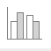
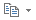
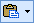

Excelにはデータベースとしての機能もあります。その中の、ソートとフィルターについて説明します。

以下では、[統計表](./population.xlsx) を用いて説明します。元のデータは、平成27年度の国勢調査です。

-   [第1表 人口，人口増減（平成22年〜27年），面積及び人口密度](http://www.e-stat.go.jp/SG1/estat/GL08020103.do?_csvDownload_&fileId=000007591144&releaseCount=2)

注) 国勢調査令（昭和55年政令第98号）の規定に基づき，調査の対象から除外された次の地域の面積を除いて算出した。
<ul>
<li>歯舞群島(99.94km2)</li>
<li>色丹島(253.33km2)，国後島(1498.83km2)及び択捉島(3184.04km2) (属島を含む)</li>
<li>竹島(0.23km2)</li>
</ul>
また、一部境界未定のため，総務省統計局において推定した。

<!-- 関数の利用を追記する？ -->

ソート
------

データの並び替えを行います。

### 簡易並べ替え

並べ替える基準になるセルを選択します。そして[ホーム]リボン - [編集]タブ - [並び替えとフィルター]をクリックします。
その後、[昇順]もしくは[降順]をクリックして、並び替えを行います。



"並び替えの前に"ウィンドウが表示されたら、[選択範囲を拡張する]を選択し、[並び替え]をクリックします。



並び替えが行われました。



文字列以外にも、数値を並び替えることも出来ます。下の例は、"平成22年"を昇順で並び替えたものです。



### 通常の並び替え

さらに複雑な並び替えをする場合、こちらの方法を用います。

まず、[ホーム]リボン - [編集]タブ - [並び替えとフィルター] - [ユーザー設定の並び替え]をクリックします。



すると、以下のようなウィンドウが開きます。



ここでは、複数の条件の並べ替えを行うことが出来ます。[レベルの追加]をクリックして、新たに条件キーを追加してみましょう。



条件キーは上から順番に適用されていきます。
また、[並び替えオプション]をクリックすると、さらにいろいろなオプションを指定することができます。



フィルター
--------

Excelには、フィルターというデータを抽出する機能があります。

### オートフィルター

まず、表内の適当なセルを選択後、[ホーム]リボン - [編集]タブ - [並び替えとフィルター] - [フィルター]をクリックしましょう。





このフィルターは[ホーム]リボン - [編集]タブ - [並び替えとフィルター] - [フィルター]を再度押すことで解除することができます。

**フィールド名の行の一部が結合されていたり、同じ名前のフィールドがあるとうまくいかないことがあります。**

各フィールド名に  がつきました。クリックしてみましょう。



出てきたメニューで要素を抽出したり、並び替えを行うことが出来ます。
ここでは、試しに[数値フィルター] - [トップテン]をクリックしてみましょう。



"トップテン オートフィルター"ダイアログが出てきます。各項目を適切に設定して、[OK]をクリックしましょう。



すると、条件にあうレコードのみ表示されます。
これだけでは見にくいので、さらに降順に並び替えをするとよいでしょう。
また、元に戻したいときは、"すべて"をクリックします。
[ホーム]リボン - [編集]タブ - [並び替えとフィルター] - [クリア]でもできます。



次に、テキストでの検索を行ってみます。
[テキストフィルター] - [指定の値を含む]をクリックしてみましょう。





このように、さらに複雑な条件での抽出ができます。
また、`?` や `*` のワイルドカードも使用できます。



上の例では、条件を "を含む" から "と等しい" に変えて、`*しま*` と入力しました。
これはさきほどのものと全く同じ意味です。[OK]をクリックします。



すると、県名に "しま" が含まれるもののみ抽出されました。

さらに、条件を表で指定することもできます。
まず、以下の表を適当な場所に作成しましょう。
今回は "K3" と "K4" に入力してみます。



次に、[データ]リボン - [並び替えとフィルター]タブ - [詳細設定]をクリックします。



[リスト範囲]は既に正しく選択されていることを確認してください。
[検索条件範囲]に、先ほど作成した表を指定しましょう。



[抽出先]を[選択範囲内]のままにすると、今まで同様、条件に合わない部分が非表示になった表となります。
[指定した範囲]を選択すると、下の"抽出範囲"がアクティブになります。
これを使うと、条件にあうレコードのみの新しい表が作成されます。
"抽出範囲"には、新たに表を作成したい範囲を指定します。

今回は `A55:I55` に表を作成してみます。



とても便利な機能です。覚えておきましょう。

この他にも、ピボットテーブルやVBAといったものもあります。興味がある人は調べてみましょう。

基本グラフの作成
----------------

前回まではデータを数値のままで扱ってきましたが、今回は、数値からグラフ化することで、より視覚的にわかりやすくするための方法を学びます。
データファイルは、前回作成した人口統計表のデータファイルを使用します。



### グラフの作成



実際にグラフを作成してみましょう。

&#9312; まず、グラフを作成したい領域を選択します。

&#9313; 次に、[挿入]リボン - [グラフ]タブ - [縦棒] -  *集合縦棒* を選択します。



グラフが作成されました。このまま使ってもあまり支障はありませんが、項目名が見辛くなってしまっているので、変更していきましょう。





&#9312; まず、編集したいグラフをクリックしてアクティブにしておきます。"グラフツール"がリボンに出てきました。

&#9313; 次に、"グラフツール" - [デザイン]リボン - [データ]タブ - [データの選択]をクリックします。



&#9314; "データ ソースの選択"ウィンドウが表示されました。



&#9315; 次に、項目名を変えてみましょう。"人口(単位万人) 男女計" をクリックしてアクティブにしておき、"凡例項目（系列）" - [編集]をクリックします。"系列の編集"ウィンドウが表示されました。



&#9316; "系列名"の `=Sheet1!$B$2:$B$3` を `=Sheet1!$B$3` に変更してみましょう。これで、`人口(単位万人) 男女計` となっていたのが `男女計` に直りました。

&#9317; 同様に"人口(単位万人) 男"と"人口(単位万人) 女"の系列も変更しておきましょう。

&#9318; 次に、横軸ラベルの範囲を確認します。横軸の編集は"横（項目）軸ラベル" - [編集]をクリックします。



&#9319; "軸ラベルの範囲"が `=Sheet1!$A$4:$A$12` となっています。今回は変更する必要がありません。





これで、グラフの設定が一通り終わりました。
また、Excelでは自動的にグラフの設定を行ってくれるので、それに合わせた表作りをすれば、さらに簡単に終わらせることもできます。

どのような表作りが適切なのか、考えてみてもよいでしょう。

### グラフの編集

これまでは、データから単純にグラフを作るところまでを扱ってきました。
実際には、さらに見やすくするための加工が必要になってきます。

#### プリセットの視覚スタイルの利用

Excelにはプリセットで使用できる視覚スタイルが数多く用意されています。

&#9312; まず、"グラフツール" - [デザイン]リボン - [グラフのスタイル]タブの  *その他* をクリックします。



&#9313; 次に、好みの視覚スタイルを選び、クリックしてみてください。グラフがプリセットの視覚スタイルに変更されます。



#### グラフタイトルや軸ラベルの挿入

グラフを見ただけで内容がわかるようにするためには、タイトルや軸ラベルなどの説明が欠かせません。今回はこれらを追加していきましょう。

&#9312; まず、グラフタイトルを追加します。
"グラフツール" - [デザイン]リボン - [グラフの要素を追加]タブ - [グラフタイトル]をクリックしてください。この教材では[グラフの上]を選択しています。



&#9313; グラフタイトルが挿入されました。グラフタイトルをクリックすると、グラフタイトルを編集することができます。



&#9314; 次に軸ラベルを入力してみましょう。
"グラフツール" - [デザイン]リボン - [グラフ要素を追加]タブ - [軸ラベル]をクリックしてください。ここで各軸ラベルを設定できます。

&#9315; まずは[第１横軸ラベル]をクリックして横軸にラベルを付けます。



&#9316; 横軸にラベルが挿入されました。グラフタイトルと同様にクリックすると、ラベルを編集することができます。



&#9317; 次に[第１縦軸ラベル]をクリックして縦軸にラベルを付けます。



&#9318; 縦軸にラベルが挿入されました。こちらも同様にクリックすると、ラベルを編集することができます。



#### 誤差範囲の設定

データには誤差がつきものですが、この誤差範囲もグラフに表示することができます。

&#9312; まず、"グラフツール" - [デザイン]リボン - [グラフの要素を追加]タブ - [誤差範囲]をクリックします。



&#9313; 後は、適用したい方式の誤差範囲をクリックすると、誤差範囲が表示されます。



#### グラフの書式設定

グラフの書式は、基本的に"グラフツール" - [書式]リボン - [現在の選択範囲]タブ - [選択対象の書式設定]で変更することができます。

&#9312; まず、"グラフツール" - [書式]リボン - [現在の選択範囲]タブのプルダウンメニューを、変更したいものに変えます。（変更したいところをクリックしても変わります。）



&#9313; 次に、"グラフツール" - [書式]リボン - [現在の選択範囲]タブ -[選択対象の書式設定]をクリックします。



&#9314; 出てきた"書式設定"メニューには、選択対象に合わせた書式設定の項目が表示されます。



主な例としては以下のようなものです。

<dl>
<dt>系列のオプション</dt>
<dd>系列同士の重なりや、要素の間隔、第二軸の使用などが設定できます。</dd>
<dt>凡例のオプション</dt>
<dd>凡例の位置などを設定できます。</dd>
<dt>軸のオプション</dt>
<dd>目盛間隔や交点の処理、ラベルの位置など、軸に関しての設定ができます。</dd>
<dt>表示形式</dt>
<dd>目盛やラベルなどの表示の仕方を設定します。基本的にはセルの表示形式と同じように設定できます。</dd>
<dt>配置</dt>
<dd>軸のラベルなどの配置を設定することができます。</dd>
<dt>縦軸（横軸）誤差範囲</dt>
<dd>縦軸（横軸）の誤差範囲の表示方式を設定します。</dd>
<dt>塗りつぶし</dt>
<dd>選択対象の背景色などを設定することができます。</dd>
<dt>枠線の色</dt>
<dd>選択対象の枠線の色を設定します。</dd>
<dt>枠線のスタイル</dt>
<dd>選択対象の枠線の線種や角を丸めるなどをすることができます。</dd>
<dt>影</dt>
<dd>選択対象に影をつけることができます。これによって視覚的に背景からうまく分離することが可能です。</dd>
<dt>3-D 書式</dt>
<dd>選択対象を三次元的に傾けたり、光源や質感を変更することで視覚的な効果を生むことができます。</dd>
</dl>

これらの書式設定を組み合わせて駆使すれば様々なグラフを作ることができます。色々なものを試して、より見やすいグラフ作成を目指しましょう。



#### グラフの種類変更

グラフを選択し、[挿入]リボン - [グラフ]タブを用いてグラフの種類を変えます。

#### グラフの消去

グラフを選択して[Delete]キー、あるいは[ホーム]リボン - [編集]タブの  *クリア* の[すべてクリア]をクリックして消去します。

### グラフの種類

Excelで作成できるグラフには、棒グラフ（ヒストグラム）のほかにもさまざまな種類があり、扱うデータによって使い分けることができます。

まず、以下のような表を作成しましょう。合計数量と合計金額には数式を入れて求めてみましょう。わからなかったら前回の [数式処理](../01/index.html) を見直しましょう。



#### 折れ線グラフ

複数の系列のデータを比較するときに便利です。
ここでは、曜日別の売り上げ変化を表しています。



#### 円グラフ

全体に対する割合を示すときによく使われます。
ここでは、合計売り上げ金額の割合を表しています。



#### レーダーグラフ

構成要素の偏りなどを見るときに便利な図です。



第2数値軸を用いた複合グラフの作成
---------------------------------

これまで作成したグラフは、x軸とy軸のスケールが一つずつでしたが、異なる二つのy軸を持つグラフを作ることもできます。

ここでは、降水量と気温のグラフ（雨温図）を作ります。

&#9312; まず、以下の表を作成します。



&#9313; 次に、グラフを作成したい領域を選択し、棒グラフを作ります。

&#9314; 次に、グラフの気温の項目を選択（グラフ内の気温のバーをクリック）し、[挿入]リボン - [グラフ]タブ - [折れ線]の中の任意の折れ線を選びます。



&#9315; さらに、気温の項目を選択したまま、"グラフツール" - [書式]リボン - [現在の選択範囲]タブ - [選択対象の書式設定]をクリックします。

選択対象 `系列"平均気温"` を選択します。



&#9316; [系列のオプション]の中の"使用する軸"を[第2軸]にします。



これで第二数値軸を設定することができました。



グラフが作成されたら、これまでと同じように編集を加えましょう。



Excelの表・図のWord文書への貼りつけ(ペースト)
---------------------------------------------

今後レポートを提出する際など、Excelで作成した図や表を、Wordにコピーしたいと思うことが多くなると予想されます。
ここで簡単Excel図、表のコピーとWordへのペーストについて確認しましょう。

### 表のコピー＆ペースト

&#9312; 図表を貼り付けたいWordファイルを開く、あるいは新規作成します。

&#9313; Excelを起動し、表を作成します。罫線も入れ、最終的な形にしておくことが望ましいです。（ただし、罫線やデータの配置などはWordからも編集できる）

&#9314; Excelにて対象表部分をドラッグして選択し、[ホーム]リボン - [クリップボード]タブの  *コピー* を選択します。あるいはショートカットキー（Windowsであれば[Ctrl]+[C]）を利用します。



&#9315; Wordの画面を表示させます。挿入したい位置にカーソルを置き、[ホーム]リボン - [クリップボード]タブの  をクリックします。あるいはショートカットキー（Windowsであれば[Ctrl]+[V]）を使います。



&#9316; Excelの表がペーストされました。必要であれば、貼り付けた際に出てくる  をクリックして、貼り付ける形式を変更します。



### 図のコピー・ペースト

&#9312; Excelにてグラフ・図を作成します。図はExcelですべて最後の最後まで仕上げておくのが望ましいです。

&#9313; 先の表と同じように選択してコピーします。

&#9314; Wordに移ります。先の表と同様に貼り付けます。

&#9315; Excelのグラフがペーストされました。必要であれば、貼り付けた際に出てくる  をクリックして、貼り付ける形式を変更します。



なお、外部のExcelファイルとワード内に貼り付けたグラフをリンクさせることもできるので、Excel内の数字を変えて試してみましょう。
