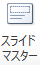
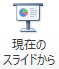
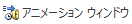

プレゼンテーションの意義・目的
----------------------

「プレゼンテーションとは何をすることか？」と聞かれたら、あなたはどのように答えますか。スライドを作って話すこと、そのように思われがちですが、実際には明確な目的を達成するための手段であり、段階的な準備が必要となります。

図1.1. に示したように、プレゼンテーションには、アイディアを論理的に構成・表現するという内容の論理性と、アイディアを適切な形で聞き手に届けるという発表の表現力が含まれます。ここでは、どちらか一方に偏って学習するのではなく、両方の観点からよいプレゼンテーションができるようになることを目指していきたいと思います。



冒頭の質問に戻りますが、プレゼンテーションのわかりやすい定義としては、以下のようなものがあります。

　　情報やアイディアを他者に伝えて理解してもらい、さらに、それを受け入れてもらうこと。説得を目的とした営み。

つまり、調べたことや自分の意見を話すだけでは、プレゼンテーションとはいえないということになります。聞き手がどのように受け止めるのか、そこから何を一緒に考えていけるのかを視野に入れた上で、伝えたい情報やアイディアを整理する必要があります。

大学では近年、プレゼンテーション教育を重視する傾向が強くなっています。その理由としては、社会で働くための基礎能力のひとつに、自分の意見をわかりやすく伝える力が位置づけられていることが挙げられます。例えば、研究成果や企画案などの専門的な内容を伝えるためだけでなく、広報活動や説明会のような場で広く一般的な話をする際にも、プレゼンテーションの技術が大切だと認識されはじめています。

プレゼンテーションの内容と構成
--------------------------

大学の授業でプレゼンテーションをすることになったら、あなたはどのような順番で、何枚くらいのスライドを作成しようと思いますか。経験がなく、どうしてよいかわからないときは、以下に示す基本的な構成を参考にしてみましょう。

1. 表紙
1. アウトライン（発表の流れ）
1. テーマの紹介
1. 主張（考え・意見）
1. 主張を支える根拠

**①表紙**には、プレゼンテーションのタイトル、発表者の学修番号と氏名、発表日などを記載します。必要に応じて、発表の場所（教室）や内容に関連する画像などを入れてもよいでしょう。

**②アウトライン**とは、プレゼンテーションの概要を表します。どのような順番で何について話すのか、全体の流れがわかるようなスライドを１枚用意すると、話の展開が見えやすくなり、聞き手の理解が進みます。

**③テーマの紹介**では、中心となる話題（トピック）をわかりやすくスライドにまとめてみましょう。「～について、あなたはどう思うか？」や「なぜ、～は重要なのか？」のように、「問い」の形でテーマを紹介すると、聞き手の興味や関心を引き付けやすくなります。

**④主張（考え・意見）**と**⑤主張を支える根拠**は、場合によって順番を入れ替えたり、④→⑤→④のように繰り返してもかまいません。先にあなたが伝えたいことを述べて、後からそれを裏付ける情報を出すのか、それとも客観的なデータをいくつか示した上で、あなたの考えを結論としてまとめるのか、より説得的だと思う順番を探してみましょう。

プレゼンテーションで重要となるのは、内容を整理し、全体の構成を考えることです。調べた情報をそのまま列挙するのではなく、明らかになった事実とそれに対する意見を「根拠」としてまとめ、根拠に基づいて自分の「主張」を展開する必要があります。

例えば、5分程度のプレゼンテーションの場合、①から④までに各１枚、⑤については２枚程度のスライドを作成してみましょう。一般的に、１枚のスライドを１分程度で話すイメージを持っておくと、内容を詰め込み過ぎなくてよい、と言われています。もう少し長いプレゼンテーションであれば、③から⑤に数枚ずつ割り当てることになります。

プレゼンテーションの準備
--------------------------

プレゼンテーションを成功させるためには、段階的な準備が必要です。ここでは、「内容と構成を考える」「スライドを作成する」「発表練習をする」の大きく３段階に分けて、説明をしたいと思います。

**内容と構成を考える**

はじめに、プレゼンテーションに与えられた時間を確認し、全体の構成を紙にざっと書き出してみることをおすすめします。何枚程度のスライドに内容をまとめるのか、どのような流れで話すとわかりやすいのかなど、聞き手のことを想像しながら、プレゼンテーションのイメージを膨らませてみましょう。

具体的には、授業で与えられた課題を確認して、大きなテーマを絞り込みます。中心となる話題（トピック）や、自分が伝えたい主張がある程度決まったら、関連する文献を検索・収集し、そこに書かれている情報をもとに、根拠についてまとめていきます。

ここでの根拠には、実験や調査、テストなどで客観的に真偽を判断できる「事実（データ）」と、発表者の推論や判断を含み、真偽を決めることはできないが妥当性を問われる「意見（解釈）」が含まれます。どちらか一方の羅列になったり、両者が混在したりしないよう、注意深く考える必要があるでしょう。

**スライドを作成する**

最も知られているプレゼンテーションソフトは、Microsoftが提供している「PowerPoint（パワーポイント）」で、日本では「パワポ」の愛称で親しまれています。PowerPointを使うと、文字や画像、グラフや表などが入った、わかりやすく見栄えのよいスライドを作成できます。

現時点の最新バージョンは、PowerPoint2016です。実際の操作方法については、「4. Microsoft PowerPoint 2016の概要」に説明が記載されています。

**発表練習をする**

スライドの作成が終わり、準備は終わったと安心してはいけません。本番を迎えるまでに、繰り返し発表練習をすることが重要です。なぜなら、頭の中で考えた構成の通りスムーズに話すということは、思っているよりも難しいことだからです。

詳しくは「6. 口頭・身体表現」に記載されていますが、プレゼンテーションでは基本的に、聞き手の方を見ながら、ゆっくり、はっきりと話す必要があります。つまり、スライドをその場で読み上げるのではなく、聞き手とコミュニケーションをとるつもりで発表しなければなりません。ときには、その場の雰囲気を感じながら、アドリブも交えて臨機応変に対応することも求められます。

そのためには、各スライドで何を伝えたいのかを言語化し、話す内容を頭に入れておくとよいでしょう。そして、何度も練習をすることで、緊張せずにわかりやすく発表できる度胸と技術が身に付いていきます。

Microsoft PowerPoint 2016の概要
-------------------------------

### Microsoft PowerPointの起動

1. [スタート]をクリックします
1. [すべてのプログラム] - [Microsoft Office] - [PowerPoint 2016] をクリックします

### プレゼンテーションの作成

PowerPoint を起動すると、スタート画面が表示されます。



ここで、新規にプレゼンテーションを作成するか、あるいは既存のプレゼンテーションファイルを開くかを選びます。

新規に作成する場合は、右側のサムネイルから利用したいテーマを選ぶことで、そのテーマを適用したファイルが新規作成されます。

また既存ファイルの場合は、Windows エクスプローラーで目的のファイルのあるフォルダに移動し、そのアイコンをダブルクリックで開くこともできます。

### プレゼンテーションの保存

#### 文書の保存

全てのアプリケーションに共通することですが、様々なトラブルにより制作途中のデータが失われてしまうことがあります。
それを防ぐためにも、作業中は**こまめに保存する**ように心がけましょう。

#### 初めてプレゼンテーションを保存する

1.   [名前を付けて保存] をクリック - 保存したいフォルダを選択します
1.  ファイル名を入力し 、ファイルの種類を選択して[Enter] キーもしくは [保存] をクリックします

<dl>
<dt>PowerPoint プレゼンテーション(.pptx)</dt>
<dd>PowerPoint 2007 以降で利用できる標準形式で保存します。</dd>
<dt>PowerPoint 97-2003 プレゼンテーション(.ppt)</dt>
<dd>Microsoft PowerPoint 97 から PowerPoint 2003 までで標準利用されていた形式で保存します。</dd>
<dt>OpenDocument プレゼンテーション(.odp)</dt>
<dd>Microsoft Office 以外のオフィス製品でも利用できる、オフィススイートの共通形式で保存します。</dd>
<dt>PowerPoint スライドショー(.ppsx)</dt>
<dd>作成したプレゼンテーションをスライドショー表示で保存します。</dd>
<dt>PowerPoint 画像化プレゼンテーション(.pptx)</dt>
<dd>プレゼンテーションと同じ拡張子ですが、各スライドを画像に変換して保存します。</dd>
<dt>PDF(.pdf)</dt>
<dd>PDF形式で保存します。PowerPoint がインストールされていない環境でも、PDF に対応するソフトウェアがあれば開くことができます。</dd>
</dl>

#### 既存の文書の変更を保存する

1.   をクリックします
1.  （[上書き保存]）をクリックします

あるいは、クイックアクセスツールバーの  をクリックします。

### PowerPoint の終了

#### ファイルを閉じる

1.   をクリックします
1.  [閉じる]をクリックします

開いているファイルを閉じるだけで、PowerPoint は終了しません。

#### PowerPoint の終了

ウィンドウ右上の閉じるボタンをクリックします。

### ウィンドウ構成



メインの領域に表示される白い紙のような部分が、1枚のスライドを表しています。
ここに文字や図表を配置していきます。

左の領域には、プレゼンテーションファイル内のスライドがサムネイル表示されます。
新規作成した状態では、1ページ目のタイトル用スライドが表示されています。
スライドを複数まとめたものが一つのプレゼンテーションファイルとなります。

### リボン

画面上部のリボンには、プレゼンテーション作成のための処理を割り当てたボタンが、機能ごとにパネルに分類され、配置されています。

リボン上部のタブ状になった[ホーム]、[挿入]、[デザイン]、[画面切り替え]、[アニメーション]、[スライドショー]、[校閲]、[表示] をクリックすることによって、各機能のパネルに切り替えることができます。もしくは、リボンにカーソルを合わせてマウスホイールを回すと、切り替えることができます。

#### ホーム

新しいスライドの追加や文字装飾、図形描画などの処理がまとめられています。



#### 挿入

表や画像、図、メディアクリップなどを挿入します。



#### デザイン

背景や文字色などをセットにした "テーマ" や、配色パターンのセットである "バリエーション" を使い、デザインを変更します。



#### 画面切り替え

あるスライドから次のスライドに移動するときに、アニメーション効果をつけることができます。



#### アニメーション

スライド内の要素に対してアニメーションの効果を設定したり、順序・タイミングを調整します。



#### スライドショー

スライドショー表示をコントロールします。リハーサルやナレーションの録音なども行えます。



#### 校閲

スペルチェックや翻訳、コメントの挿入などできあがったプレゼンテーションファイルに対する校正のメニューです。



#### 表示

PowerPoint の画面での表示方法を設定します。



パネルの右下に  ボタンが表示されている場合は、より詳しく各項目を設定することができます。

また、それぞれのボタンにカーソルをポイントすると、その機能の説明を見ることができます。

スライドのデザイン
------------------

### 内容のグループ化

### テキストや図の配置

### 行間の設定

### フォントの選択

### 配色の工夫

口語・身体表現
-----------------

### 話し方

### 姿勢

プレゼンテーションを作る流れ
----------------------------

### スライドの準備(背景のデザインとスライドマスターの設定)

内容を作り始める前に、スライド全体のデザインを考えましょう。

一つのプレゼンテーションでは、一つの流れのある内容を発表するため、全体の話が一貫して見えるように、スライドのデザインもある程度統一して作る必要があります。
具体的には、下記のような項目が各スライドで共通に表示したい項目です。

* 背景デザイン
* フッター
* スライド番号

これは誰もが必ずすべきことではありませんが、もし自分のプレゼンテーションに必要だと思ったら積極的に利用しましょう。
使わない場合と見比べてみて、見やすいほうを使う、あるいはほかの人にアドバイスしてもらうなどして、ぜひいろいろと検討してみてください。
フッターにはページ情報、タイトル、プレゼンテーションの日付、会議名称・場所などを表示するのがよいでしょう。

まずここでは、これから作成するスライドに共通する背景のデザインを導入します。
PowerPoint にはさまざまなテーマが用意されています。
この中で自分の好みにあうものがあればそれを選択します。
もちろん自分で別のデザインを作ることも可能ですし、背景を単一色で統一することもできます。

&#9312; [デザイン]リボン - [テーマ]の中から使いたいデザインを選びます。



テーマの  を押すとテーマのデザインの一覧を見ることができます。





また、デザインの上にカーソルを置くと、現在のファイルにテーマを適用した場合のプレビューを見ることができます。



さらに、各スライドの文字のフォントやサイズ、色、フッターなどを共通して設定するために、スライドの設定を行います。

&#9313; [表示]リボン -  をクリックします。





&#9314; フォントサイズや色、箇条書きのレベルなどを好きな形式に変更します。
その形式が今後このプレゼンテーションを作成していくに際して、標準の設定となります。



&#9315;  をクリックして、通常表示に戻ります。



&#9316; [挿入]リボン -  をクリックします。



&#9317; 日付/時刻、フッター、(スライド番号)を設定し、[すべてに適用]をクリックします。

**[すべてに適用]を押すと、全てのスライドが、[適用]を押すと選択したスライドのみが、設定されます。**





ここでの設定も必須ではありません。多くの項目は、テーマによって最初から設定されています。

### スライドの作成

ここまででスライドの準備が終わりました。あとはプレゼンテーションの流れにあわせてスライドを作成していきます。
一般的に、プレゼンテーションの最初のスライドは「表紙」ですので、PowerPoint では最初の一枚目が自動的に表紙のレイアウトになっています。
レイアウトの変更も可能です。

[ホーム]リボン -  から必要なレイアウトのスライドを選択します。







このようにして、話したいことにあわせて、スライドを作っていきます。

間違って作ったスライドや、必要のないスライドを削除したい場合は、左の領域で削除するスライドを右クリックして [スライドの削除] をクリックします。



### スライドショー

スライドが完成したら、実際にスライドショーで見てみましょう。

[スライドショー]リボン - "スライドショーの開始"パネルにある  をクリックします。





また、複数スライドを作った場合、任意のスライドからスライドショーを始めたいときは、
[スライドショー]リボン - "スライドショーの開始"パネル -  をクリックします。



スライドは、あくまでもプレゼンテーションのための補助的な資料です。
発表者の話の内容と合っているか、視覚的な効果としてわかりやすいか、意味があるかなどの点をよくチェックしましょう。

PowerPointの機能の紹介
----------------------

PowerPointでは、プレゼンテーションでの視覚的な効果をより強めるために、さまざまな機能を使うことができます。

ここでは、冒頭に紹介した「わたしの好きなWebページ」というプレゼンテーションの中で使っている「アニメーション」「ハイパーリンク」「クリップアート」という3つの視覚効果の使い方を見ていきましょう。

### アニメーション

ここでは，最初に表示される3つの疑問に対し、それぞれの「答え」として順番に表示させます。

&#9312; [アニメーション]リボン -  をクリックします。
画面右に "アニメーション ウィンドウ" が現れました。





&#9313;  まず、一つめの答えになる"答え＝ 1時間から3時間"を選択します。



&#9314;  [アニメーション]リボン - [アニメーションの追加] - [開始] - [スライドイン]をクリックします。





&#9315;  アニメーションが追加されました。同様に他の二つの答えも設定します。



これでアニメーションの設定ができました。
[再生]や[アニメーション]リボン - [プレビュー]を押すと、アニメーションを確認できます。

"開始" や "方向"、 "速さ" を調節することによって、動きをつけたプレゼンテーション資料が作成できます。
[アニメーション]リボン - [効果のオプション] では、さらに詳細な設定を行うことができます。

[効果のオプション]は"アニメーションウィンドウ"でアニメーション横の[▼]からも表示できます。





### ハイパーリンク

3つのWebページを紹介するときに、ハイパーリンクを利用しています。



文字にハイパーリンクを設定すると、多くのテーマでは文字色が変わり、下線が表示されます。
スライドショーでは、ハイパーリンクが設定された文字をクリックすることで、設定されたリンク先のスライドまでジャンプできます。

&#9312; リンクをはりたい "NASAのページ" を選択します。



&#9313; [挿入]リボン -  をクリックします。



&#9314; 7ページ目の "NASAのページ" にリンクをはります。選択をして、[OK] をクリックします。



文字色が変わり、下線が付きました。
スライドショーを実行し、リンクをクリックしてみると、7 ページ目の"NASAのページ"へリンクできていることが確認できます。





ハイパーリンクでは、ほかのファイルやWebページなどもリンク先として指定することができます。
例で示したスライドを参考に、さまざまな使い道を考えてみましょう。

### イメージ画像の挿入

プレゼンテーション資料では、イメージを伝えるために画像を利用することもできます。



今回は 2 ページ目に、コンピューターの画像を配置します。
コンピュータ内にファイルとして保存されている画像を利用することもできますが、ここではオンライン画像を検索して挿入します。



&#9312; [挿入]リボン - [オンライン画像]をクリックします。



&#9313; "Bing イメージ検索" にキーワード `コンピュータ` を入力し、[Enter] キーをクリックします。



&#9314; Bing イメージ検索では、標準ではウェブ上のクリエイティブ・コモンズ・ライセンスが明記された画像を検索し、候補として表示します。
画像をクリックし、下部のリンクをクリックすると出典のウェブページが表示されます。ライセンスを確認し、利用目的にあった画像を探してください。





&#9315; 任意の画像を選択し、挿入します。レイアウトを考えて、好きな場所に移動させてください。



課題
----

「わたしの好きなWebページ」というタイトルで、下記の条件を踏まえたプレゼンテーションを作ってみましょう。

-   少なくとも３枚は図を使用すること
    - オンライン画像でも、自分で作成した図でもかまいません
    - 自分以外の著作物の場合はライセンスに注意し、適切に使用してください
-   ハイパーリンク、アニメーションを１回以上利用すること

必要な場合はExcelでグラフや表などを作成してもいいでしょう。

