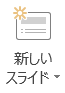

テーマを利用したスライドの作成
-------------------

### テーマの選択とスライドマスターの設定

内容を作り始める前に、スライド全体のデザインを考えましょう。

一つのプレゼンテーションでは、一つの流れのある内容を発表するため、全体の話が一貫して見えるように、スライドのデザインもある程度統一して作る必要があります。
具体的には、下記のような項目が各スライドで共通に表示したい項目です。

* 背景デザイン
* フッター
* スライド番号

これは誰もが必ずすべきことではありませんが、もし自分のプレゼンテーションに必要だと思ったら積極的に利用しましょう。
使わない場合と見比べてみて、見やすいほうを使う、あるいはほかの人にアドバイスしてもらうなどして、ぜひいろいろと検討してみてください。
フッターにはページ情報、タイトル、プレゼンテーションの日付、会議名称・場所などを表示するのがよいでしょう。

まずここでは、これから作成するスライドに共通する背景のデザインを導入します。
PowerPoint にはさまざまなテーマが用意されています。
この中で自分の好みにあうものがあればそれを選択します。
もちろん自分で別のデザインを作ることも可能ですし、背景を単一色で統一することもできます。

&#9312; [デザイン]リボン - [テーマ]の中から使いたいデザインを選びます。



テーマの  を押すとテーマのデザインの一覧を見ることができます。





また、デザインの上にカーソルを置くと、現在のファイルにテーマを適用した場合のプレビューを見ることができます。



さらに、各スライドの文字のフォントやサイズ、色、フッターなどを共通して設定するために、スライドの設定を行います。

&#9313; [表示]リボン -  をクリックします。





&#9314; フォントサイズや色、箇条書きのレベルなどを好きな形式に変更します。
その形式が今後このプレゼンテーションを作成していくに際して、標準の設定となります。



&#9315;  をクリックして、通常表示に戻ります。



&#9316; [挿入]リボン -  をクリックします。



&#9317; 日付/時刻、フッター、(スライド番号)を設定し、[すべてに適用]をクリックします。

**[すべてに適用]を押すと、全てのスライドが、[適用]を押すと選択したスライドのみが、設定されます。**





ここでの設定も必須ではありません。多くの項目は、テーマによって最初から設定されています。

### スライドの追加と削除

ここまででスライドの準備が終わりました。あとはプレゼンテーションの流れにあわせてスライドを作成していきます。
一般的に、プレゼンテーションの最初のスライドは「表紙」ですので、PowerPoint では最初の一枚目が自動的に表紙のレイアウトになっています。
レイアウトの変更も可能です。

[ホーム]リボン -  から必要なレイアウトのスライドを選択します。







このようにして、話したいことにあわせて、スライドを作っていきます。

間違って作ったスライドや、必要のないスライドを削除したい場合は、左の領域で削除するスライドを右クリックして [スライドの削除] をクリックします。



### スライドショー

スライドが完成したら、実際にスライドショーで見てみましょう。

[スライドショー]リボン - "スライドショーの開始"パネルにある  をクリックします。





また、複数スライドを作った場合、任意のスライドからスライドショーを始めたいときは、
[スライドショー]リボン - "スライドショーの開始"パネル -  をクリックします。



スライドは、あくまでもプレゼンテーションのための補助的な資料です。
発表者の話の内容と合っているか、視覚的な効果としてわかりやすいか、意味があるかなどの点をよくチェックしましょう。

Microsoft PowerPoint 2016の主な機能
-------------------

### 画面切り替え

画面切り替えとは、次のスライドに移る際の視覚的効果のことです。

#### 画面切り替えのアニメーションの設定

①設定するスライドをクリックして表示します。１枚目のスライドから２枚目のスライドに移る際の画面切り替え効果は、２枚目のスライドをクリックします。



②[画面切り替え]リボンをクリックして画面切り替え効果を表示します。



③その他[▼]をクリックすると画面切り替え効果の一覧が表示されます。好きな画面切り替え効果をクリックし選択します。



設定が完了したスライドにはスライド左横に[★]が表示されます。

④プレビューをクリックすると画面切り替え効果が再生されます。



### アニメーション

ここでは，最初に表示される3つの疑問に対し、それぞれの「答え」として順番に表示させます。

&#9312; [アニメーション]リボン -  をクリックします。
画面右に "アニメーション ウィンドウ" が現れました。





&#9313;  まず、一つめの答えになる"答え＝ 1時間から3時間"を選択します。



&#9314;  [アニメーション]リボン - [アニメーションの追加] - [開始] - [スライドイン]をクリックします。





&#9315;  アニメーションが追加されました。同様に他の二つの答えも設定します。



これでアニメーションの設定ができました。
[再生]や[アニメーション]リボン - [プレビュー]を押すと、アニメーションを確認できます。

"開始" や "方向"、 "速さ" を調節することによって、動きをつけたプレゼンテーション資料が作成できます。
[アニメーション]リボン - [効果のオプション] では、さらに詳細な設定を行うことができます。

[効果のオプション]は"アニメーションウィンドウ"でアニメーション横の[▼]からも表示できます。





### リンクの挿入

3つのWebページを紹介するときに、ハイパーリンクを利用しています。



文字にハイパーリンクを設定すると、多くのテーマでは文字色が変わり、下線が表示されます。
スライドショーでは、ハイパーリンクが設定された文字をクリックすることで、設定されたリンク先のスライドまでジャンプできます。

&#9312; リンクをはりたい "NASAのページ" を選択します。



&#9313; [挿入]リボン -  をクリックします。



&#9314; 7ページ目の "NASAのページ" にリンクをはります。選択をして、[OK] をクリックします。



文字色が変わり、下線が付きました。
スライドショーを実行し、リンクをクリックしてみると、7 ページ目の"NASAのページ"へリンクできていることが確認できます。





ハイパーリンクでは、ほかのファイルやWebページなどもリンク先として指定することができます。
例で示したスライドを参考に、さまざまな使い道を考えてみましょう。

### 表・画像・図の挿入

プレゼンテーション資料では、イメージを伝えるために画像を利用することもできます。



今回は 2 ページ目に、コンピューターの画像を配置します。
コンピュータ内にファイルとして保存されている画像を利用することもできますが、ここではオンライン画像を検索して挿入します。



&#9312; [挿入]リボン - [オンライン画像]をクリックします。



&#9313; "Bing イメージ検索" にキーワード `コンピュータ` を入力し、[Enter] キーをクリックします。



&#9314; Bing イメージ検索では、標準ではウェブ上のクリエイティブ・コモンズ・ライセンスが明記された画像を検索し、候補として表示します。
画像をクリックし、下部のリンクをクリックすると出典のウェブページが表示されます。ライセンスを確認し、利用目的にあった画像を探してください。





&#9315; 任意の画像を選択し、挿入します。レイアウトを考えて、好きな場所に移動させてください。



著作物を利用する際の注意事項
-------------------

### 著作権

### クリエイティブ・コモンズ

### 参考文献リスト

課題①
-------------------