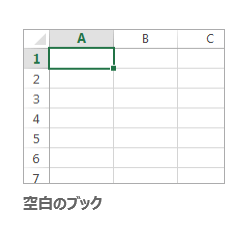

授業ガイダンス
--------------

この授業で学ぶこと、成績評価などについてお話します。配布済のシラバス・履修の手引きも参照して下さい。

-   [情報リテラシー実践Iシラバス](/lit/1/syllabus.pdf)
-   [履修の手引き](/lit/curriculum.pdf)

### 授業の目標

この授業は、みなさんが次の４項目を習得できるように進めていきます。

1.   オペレーティングシステム (OS) の操作と、基本的なファイル操作についての知識を身につける
1.   アプリケーションソフトウェアの操作方法について習熟する
1.   正しい情報収集・分析・判断・編集・発信・共有の能力を身に付ける
1.   アプリケーションソフトウェアを活用して、具体的な課題解決をする

### 受講上の注意

この授業を受講するにあたり、以下の点に注意してください。

-   定刻に開始して、その日の目標まで説明をしたら、残りは実習時間とします
-   授業中には携帯電話の電源を切り、使用しないでください
-   授業中にやむを得ず入室・退室する場合は教員やチューターに一言断るようにしてください

### 成績評価

この授業の成績は、以下の基準に基づいて評価します。

-   成績は、授業への取り組み、課題の提出状況など、出席も含めて総合的に評価します
-   毎回出席をとりますが、出席の確認方法は教員によって異なるので、指示に従ってください
-   原則として、4回以上の欠席で不合格となります
-   遅刻の扱い、成績にかかわる課題の提出、発表等は、教員によって異なります
-   第４講終了後にｅラーニングシステムを用いた情リテ情報倫理テストを行います

### 授業予定

最初４回の基本部分は全クラス共通です。
次に、標準コースでは「ワープロソフトによる文書編集と整形」および「表計算ソフトによる各種演算とデータ視覚化」、
「プレゼンテーションソフトによるスライド作成と発表」を扱っていきますが、第５回目以降ではクラスによって内容が異なる場合があります。

-   情報処理教室の使い方と授業ガイダンス
    -    [レディネス調査](../../../readiness/student.html)
-   [コンピュータの基本操作と構造](../02/index.html)
-   [ネットワークの仕組みと情報検索](../03/index.html)
-   [情報の活用と情報倫理](../04/index.html)
-   [ワードプロセッサによる文書編集（１）](../../office2013/word/01/index.html)
-   [ワードプロセッサによる文書編集（２）](../../office2013/word/02/index.html)
    -   [ワードプロセッサによる文書編集（発展例）](../../office2013/word/03/index.html)
    -   [課題提出のための実習時間](../../office2013/word/04/index.html)
-   [表計算ソフトによるデータ処理（１）](../../office2013/excel/01/index.html)
-   [表計算ソフトによるデータ処理（２）](../../office2013/excel/02/index.html)
-   [表計算ソフトによるデータ処理（３）](../../office2013/excel/03/index.html)
    -   [課題提出のための実習時間](../../office2013/excel/04/index.html)
-   [プレゼンテーションの概要と実習](../../office2013/powerpoint/01/index.html)
    -   [課題提出のための実習時間](../../office2013/powerpoint/02/index.html)
-   [プレゼンテーション実演](../../office2013/powerpoint/03/index.html)
-   [HTML（１）](../../html/01/index.html)
-   [HTML（２）](../../html/02/index.html)
-   [動画編集（１）](../../moviemaker/01/index.html)
-   [動画編集（２）](../../moviemaker/02/index.html)

### 教材

授業は、このコースウェアを利用して行います。

また、アプリケーションは以下のものを用います。教室によってオペレーティングシステムなどに違いがありますが、基本操作に大きな差はありません。
このコースウェアでは、一般的な Windows 環境に基づいて解説しますが、操作が異なる場合は参考資料等を参照してください。

Microsoft Wordの起動
--------------------

1.  [スタート] をクリックします
1.  [すべてのプログラム] - [Microsoft Office] - [Word 2016] をクリックします

文書の作成と保存
----------------

### 文書の作成

####  新規作成

1. Word を起動すると、スタート画面が表示されます。



ここで、新規に文章を作成するか、あるいは既存の文章ファイルを開くかを選びます。

新規に作成する場合は、右側のサムネイルから利用したいテンプレートを選ぶことで、そのテンプレートを適用したファイルが新規作成されます。

また既存ファイルの場合は、Windows エクスプローラーで目的のファイルのあるフォルダに移動し、そのアイコンをダブルクリックで開くこともできます。

#### 既存文書のオープン（改訂、再編集）

1.   タブをクリックします
1.  [コンピュータ] から [参照] をクリックしてファイルを選択して開きます。

### 文書の保存

全てのアプリケーションに共通することですが、様々なトラブルにより制作途中のデータが失われてしまうことがあります。それを防ぐためにも、**こまめに保存する**ように心がけましょう。

#### 初めて文書を保存する

1.   タブをクリックします
1.  [名前を付けて保存] - 保存したいフォルダを参照します
1.  ファイル名を入力し [Enter] キーもしくは [保存] をクリックします。

保存形式は[名前を付けて保存]のウィンドウで[ファイルの種類]から選択することができます。



もしくは [エクスポート] からファイルの種類の変更をすることも可能です。



<dl>
<dt>Word 文書(.docx)</dt><dd>Word 2007 以降で利用できる標準形式で保存します。</dd>
<dt>Word 97-2003 文書(.doc)</dt><dd>Microsoft Word 97 から Word 2003 までで標準利用されていた形式で保存します。</dd>
<dt>OpenDocument テキスト(.odt)</dt><dd>Microsoft Office 以外のオフィス製品でも利用できる、オフィススイートの共通形式で保存します。</dd>
<dt>Word テンプレート</dt><dd>作成した文書の書式設定を、再利用できるテンプレート形式で保存します。</dd>
<dt>PDF(.pdf)</dt><dd>PDF形式で保存します。Word がインストールされていない環境でも、PDF に対応するソフトウェアがあれば開くことができます。</dd>
</dl>

<strong>情報処理教室における制約事項</strong>

情報処理教室では、PDFを印刷すると、システム上の理由で印刷にかなりの時間がかかってしまいます。

#### 既存の文書の変更を保存する

1.   をクリックします
1.   [上書き保存] をクリックします

あるいは、クイックアクセスツールバーの  をクリックします。

### ファイルを閉じる

1.   をクリックします
1.  [閉じる] をクリックします

開いているファイルを閉じるだけで、Word は終了しません。

### Word の終了

ウィンドウ右上の閉じるボタンをクリックします。

タイピング練習
--------------

みなさんがパソコンを利用するとき、文字を入力すること、特に日本語を入力するという機会が非常に多いと思います。ここでは、タイピングの練習をしていきます。
日本語入力の方法については以下のページを参照してください。



### テキストエディタの選択

Windows 環境では以下の3つのテキストエディタが利用可能です。
テキストエディタとはテキスト(各種の漢字コード、ASCIIコードなど)のみがデータとして入力されている(あるいは入力しようとしている)ファイルを編集するものです。
例えばワードプロセッサなどによって作られるファイルにはテキスト以外にさまざまな付加情報が含まれているのでテキストファイルではありません。

<h5>メモ帳</h5>
Windowsに標準で付属するテキストエディタ。notepad と呼ばれることもある。

<h5>秀丸</h5>
<a href="http://hide.maruo.co.jp/">サイトー企画</a>製のシェアウェア。メモ帳よりも高機能なテキストエディタ。

<h5>TeraPad</h5>
<a href="http://www5f.biglobe.ne.jp/~t-susumu/">寺尾 進</a>氏製のフリーウェア。メモ帳よりも高機能なテキストエディタ。

<dl>
<dt>シェアウェア</dt>
<dd>ソフトウェア流通形態の一つ。試用期間が与えられ、気に入ったら購入できるという仕組みのものもある。</dd>
<dt>フリーウェア</dt>
<dd>無償で誰でも利用できるソフトウェア</dd>
</dl>

### 課題

上のエディタのいずれかひとつを用いて日本語入力実習をします。
指示に従い(あるいは自分が気に入った)エディタを起動させてください。そのエディタを使って以下の問題１〜４を入力してください。
これらの問題はそれぞれ350字前後ですが、10分を目安に入力してください(担当教員によって異なります)。

-   [課題１](./typing_1R.pdf)
-   [課題２](./typing_2R.pdf)
-   [課題３](./typing_3R.pdf)
-   [課題４](./typing_4R.pdf)

各例文ごとに別のファイルに保存しましょう。
なお、例文を入力しただけでは、他の人のファイルと区別がつきません。例文を入力する前に、自分の**学修番号**と**氏名**を入力しておきましょう。

Microsoft Excelの起動
---------------------

1.  [スタート] をクリックします
1.  [すべてのプログラム] - [Microsoft Office] - [Excel 2016]をクリックします

ブックの作成と保存
------------------

### ブックの作成

####  新規作成

1.   をクリックします
1.   -  をクリックします

#### 既存ブックのオープン（改訂、再編集）

1.   をクリックします
1.   -  - 目的のブックのあるフォルダに移動します
1.  目的のファイルのアイコン  をダブルクリック、または選択して開きます

あるいは、目的の文書のあるフォルダに移動し、そのアイコンをダブルクリックします。

### ブックの保存

全てのアプリケーションに共通することですが、様々なトラブルにより制作途中のデータが失われてしまうことがあります。それを防ぐためにも、**こまめに保存する**ように心がけましょう。

#### 初めてブックを保存する

1.   をクリックします
1.   -  の順にクリックします
1.  必要な保存形式を選択 - 保存したいフォルダに移動します
1.  ファイル名を入力し [Enter] キーを押します。もしくは [保存] をクリックします

保存形式は [名前を付けて保存] のウィンドウで [ファイルの種類] から選択することもできます。



<dl>
<dt>Excel ブック(.xlsx)</dt><dd>Excel 2007 以降で利用できる標準形式で保存します。</dd>
<dt>Excel マクロ有効ブック</dt><dd>Excelで使えるマクロを有効にしたブックです。xlsm形式で保存されます。</dd>
<dt>Excel バイナリ ブック</dt><dd>ブックの読み込み、保存をすばやく行えるように最適化した形式で保存します。</dd>
<dt>Excel 97-2003 ブック(.xls)</dt><dd>Microsoft Excel 97 から Excel 2003 までで標準利用されていた形式で保存します。</dd>
<dt>OpenDocument スプレッドシート(.ods)</dt><dd>Microsoft Office 以外のオフィス製品でも利用できる、オフィススイートの共通形式で保存します。</dd>
<dt>PDF(.pdf)</dt><dd>PDF形式で保存します。Excel がインストールされていない環境でも、PDF に対応するソフトウェアがあれば開くことができます。</dd>
</dl>

<strong>情報処理教室における制約事項</strong>

情報処理教室では、PDFを印刷すると、システム上の理由で印刷にかなりの時間がかかってしまいます。

#### 既存のブックの変更を保存する

1.   をクリックします
1.   をクリックします

あるいは、クイックアクセスツールバーの  をクリックします。

### Excel の終了

1.   をクリックします
1.  [閉じる] をクリックします
