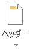

タイピング練習
--------------

みなさんがパソコンを利用するとき、文字を入力すること、特に日本語を入力するという機会が非常に多いと思います。ここでは、タイピングの練習をしていきます。
日本語入力の方法については以下のページを参照してください。



### テキストエディタの選択

Windows 環境では以下の3つのテキストエディタが利用可能です。
テキストエディタとはテキスト(各種の漢字コード、ASCIIコードなど)のみがデータとして入力されている(あるいは入力しようとしている)ファイルを編集するものです。
例えばワードプロセッサなどによって作られるファイルにはテキスト以外にさまざまな付加情報が含まれているのでテキストファイルではありません。

<h5>メモ帳</h5>
Windowsに標準で付属するテキストエディタ。notepad と呼ばれることもある。

<h5>秀丸</h5>
<a href="http://hide.maruo.co.jp/">サイトー企画</a>製のシェアウェア。メモ帳よりも高機能なテキストエディタ。

<h5>TeraPad</h5>
<a href="http://www5f.biglobe.ne.jp/~t-susumu/">寺尾 進</a>氏製のフリーウェア。メモ帳よりも高機能なテキストエディタ。

<dl>
<dt>シェアウェア</dt>
<dd>ソフトウェア流通形態の一つ。試用期間が与えられ、気に入ったら購入できるという仕組みのものもある。</dd>
<dt>フリーウェア</dt>
<dd>無償で誰でも利用できるソフトウェア</dd>
</dl>

### 課題

上のエディタのいずれかひとつを用いて日本語入力実習をします。
指示に従い(あるいは自分が気に入った)エディタを起動させてください。そのエディタを使って以下の問題１〜４を入力してください。
これらの問題はそれぞれ350字前後ですが、10分を目安に入力してください(担当教員によって異なります)。

-   [課題１](./typing_1R.pdf)
-   [課題２](./typing_2R.pdf)
-   [課題３](./typing_3R.pdf)
-   [課題４](./typing_4R.pdf)

各例文ごとに別のファイルに保存しましょう。
なお、例文を入力しただけでは、他の人のファイルと区別がつきません。例文を入力する前に、自分の**学修番号**と**氏名**を入力しておきましょう。

Microsoft Word 2016の概要
-------------------------

<strong>Microsoft Office の共通点</strong>

ウィンドウ各部の名称や基本操作は Microsoft Office 2016 の各製品（Word, Excel, PowerPoint など）で共通です。

### ウィンドウ各部の名称



### クイックアクセスツールバー

よく使うコマンドを表示しておくことができます。



初期設定で表示されているアイコンとその機能は以下の通りです。

-    上書き保存
-    元に戻す
-    繰り返す

 をクリックすると、表示するアイコンをカスタマイズできます。

### ファイルタブ

ファイルタブには、新規文書の作成、既存文章を開く、保存、印刷など文書ファイルを操作するコマンドが並んでいます。



また、[オプション] で、Word自体のより詳細な設定を行うことができます。

### リボン

文書を作成していく際によく利用するコマンドを割り当てたボタンが機能ごとにパネルに分類されています。

リボン上部のタブ状になった[ホーム]、[挿入]、[ページレイアウト]、[参考資料]、[差し込み文書]、[校閲]、[表示]をクリックすることによって、各機能のパネルに切り替えることができます。
もしくは、カーソルリボン上にあるときにホイールを回すと、切り替えることができます。

#### ホーム

主に文字の装飾、切り貼り、編集など文字に関係したコマンドがあります。



#### 挿入

表や図、ヘッダーやフッターなどを挿入します。



#### デザイン

ドキュメント全体のテーマや配色、書式などが設定できます。



#### ページレイアウト

ページのレイアウト、見やすさを設定します。



#### 参考資料

目次や脚注など、文書を補助する資料を挿入します。



#### 差し込み文書

はがきなど、特殊なレイアウトの文書を作ることができます。



#### 校閲

スペルチェックや文字カウント、コメントの挿入などできあがった文書を校正したり、また、訂正した部分の比較などを行うことができます。



#### 表示

Wordの画面での表示の仕方を設定します。



パネルの右下にある  を押すと、より詳しく各項目を設定することができます。





また、カーソルを使用したいコマンドの上で静止させると、そのコマンドの説明を見ることができます。



文章を整える
------------

### 文字のフォント、サイズ、スタイル設定



まず、文書の文字の大きさを整えます。

&#9312; 最初の行の "自己紹介カード" を選択（ドラッグ）し、フォントサイズを`16`ptに変更します。



&#9313; 同様に、2行目の"氏名"、4行目の"所属"、6行目の"趣味"、10行目の"自己紹介文"を`14`ptにします。



&#9314; さらに3行目の"首都　大"も`12`ptに変更します。



Wordでは、その他にも色々なスタイルに文字を変えることができます。

### 文字を揃える

次に、文字の位置を揃えます。通常では**両端揃え**になっており、左の端から右の端まで改行するまで文章を続けるになります。レイアウトを考える中で、**左揃え**や**右揃え**、**中央揃え**を効果的に用いると、見やすい書類を作成することができます。また、左右の余白に応じて文字を均等に振り分ける**均等割り付け**もあります。

&#9312; 最初の行の左横にカーソルを持って行きます。

&#9313; すると、カーソルの矢印の向きが左上から右上に変わります。その状態で左クリックすると、行全体を選択することができます。

&#9314; [ホーム]リボン の "段落" から  をクリックして、文字を揃えます。



これで、この書類の題名となる"自己紹介カード"が見やすくなりました。

### 段落番号と箇条書き

段落番号や箇条書きを用いることで書類の情報をわかりやすく見る人に伝えることができます。
まずは、段落番号を付けてみましょう。

&#9312; "氏名"、"所属"、"趣味"、"自己紹介文"を選択します。複数選択するためには、 [Ctrl] キーを押しながら選択します。



&#9313;  をクリックします。





このように、段落番号をつけることができます。
同様にして、趣味の内容を箇条書きにしてみましょう。
箇条書きの記号はデフォルトでは●ですが、カスタマイズすることもできます。

&#9312; "読書"、"水泳"、"旅行"を選択します。





&#9313;   の横の下向き三角をクリックします。



&#9314; 表示された行頭文字ライブラリの中から好きなものを選ことができます。



ライブラリの中にない文字や画像も"新しい行頭文字の定義"を押すことで設定することができます。
段落番号も箇条書きと同じようにカスタマイズすることができます。

### インデント設定

インデントを設定することによって、余白をうまく利用することができます。

現在の状態では、項目となる"氏名"や"所属"、"趣味"、"自己紹介文"の番号とそれぞれの内容が同じ高さで表示されてしまっていて、見にくいです。これらを項目の下につけるために、インデントを用います。

その他、段落の1行目は1字下げ、2行目以降は下げずに文章を続けていくという日本語の特徴的な文法もインデントによって設定することができます。

まず、ルーラーが非表示になっている場合、[表示]リボン の "表示" から □ルーラー のチェックボックスにチェックを入れて、ルーラーを表示しましょう。



インデントにはそれぞれ以下の役割があります。



-   1 行目のインデント：段落最初の行のインデントの位置
-   ぶら下げインデント：2行目以降のインデントの位置
-   左インデント：最初の行と2行目以降のインデント間隔と保ったままでの段落全体の左インデントの位置
-   右インデント：段落全体の右インデントの位置

&#9312; 自己紹介文の内容（はじめまして～）を選択してください。



&#9313; 1行目のインデントを1文字分右に動かします。





自己紹介文の内容の1行目を1字下がりました。次に、各項目の内容を下げます。

&#9312; 以下の画像のように内容となる部分を全て選択してください。



&#9313; 左インデントを 2 文字分右に動かします。





これで随分と見やすくなりました。
また、左インデントは [ホーム]リボンの "段落" にある  や  でもずらすことができます。

インデントはこの他、段落の詳細設定からより詳しく設定することができます。
[ホーム] リボン - "段落"パネルの右下の  をクリックします。





また、ページのレイアウト全体の設定を行うこともできます。[ページレイアウト] リボン - "ページ設定"パネルの右下の  をクリックします。




1 ページの行数や文字数などを設定することができます。



### ヘッダーとフッター

最後にヘッダーとフッターを設定しましょう。

&#9312; [挿入] リボン -  をクリックします。



&#9313; [空白] を選択します。





&#9314; ヘッダーに自分の学修番号と氏名を入力してください。



これでヘッダー部分に学修番号と氏名が設定できました。
ヘッダーやフッターを編集していると、リボンに [ヘッダー/フッター ツール] が表示されます。
次にフッターを設定します。先ほどと同じ[挿入]リボンからも操作可能ですが、現在表示されている [ヘッダー/フッター ツール] から操作してみることにします。

&#9312; [ヘッダー/フッター ツール]  [デザイン] リボン -   をクリックします。



&#9313; "ページの下部" - "番号のみ2" を選択します。





これでフッターにページ数が入りました。
また[ヘッダーとフッターを閉じる] で通常の編集画面に戻ることができます。


ヘッダーとフッターにはこの他様々な情報を入れることができます。
これでほぼ完成しました。後は、見やすいように微調整してください。

