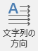

タイピング練習
--------------

みなさんがパソコンを利用するとき、文字を入力すること、特に日本語を入力するという機会が非常に多いと思います。ここでは、タイピングの練習をしていきます。
日本語入力の方法については以下のページを参照してください。



### テキストエディタの選択

Windows 環境では以下の3つのテキストエディタが利用可能です。
テキストエディタとはテキスト(各種の漢字コード、ASCIIコードなど)のみがデータとして入力されている(あるいは入力しようとしている)ファイルを編集するものです。
例えばワードプロセッサなどによって作られるファイルにはテキスト以外にさまざまな付加情報が含まれているのでテキストファイルではありません。

<h5>メモ帳</h5>
Windowsに標準で付属するテキストエディタ。notepad と呼ばれることもある。

<h5>秀丸</h5>
<a href="http://hide.maruo.co.jp/">サイトー企画</a>製のシェアウェア。メモ帳よりも高機能なテキストエディタ。

<h5>TeraPad</h5>
<a href="http://www5f.biglobe.ne.jp/~t-susumu/">寺尾 進</a>氏製のフリーウェア。メモ帳よりも高機能なテキストエディタ。

<dl>
<dt>シェアウェア</dt>
<dd>ソフトウェア流通形態の一つ。試用期間が与えられ、気に入ったら購入できるという仕組みのものもある。</dd>
<dt>フリーウェア</dt>
<dd>無償で誰でも利用できるソフトウェア</dd>
</dl>

### 課題

上のエディタのいずれかひとつを用いて日本語入力実習をします。
指示に従い(あるいは自分が気に入った)エディタを起動させてください。そのエディタを使って以下の問題１〜４を入力してください。
これらの問題はそれぞれ350字前後ですが、10分を目安に入力してください(担当教員によって異なります)。

-   [課題１](./typing_1R.pdf)
-   [課題２](./typing_2R.pdf)
-   [課題３](./typing_3R.pdf)
-   [課題４](./typing_4R.pdf)

各例文ごとに別のファイルに保存しましょう。
なお、例文を入力しただけでは、他の人のファイルと区別がつきません。例文を入力する前に、自分の**学修番号**と**氏名**を入力しておきましょう。

表の作成
--------

以下のような表を作り込み、"◇"で始まる箇条書き部分の前に入れましょう。



以下の手順で作成していきます。

### 表の概要

#### セル、行、列、m（行）&times; n（列）表

以下の図がセル、行、列の概念を表しています。それぞれ特定のセル、行、列を選択した状態になっています。それぞれの選択の仕方は実習で学びます。



これらの表は、 4 個の行と 3 個の列からできています。このような表は 4 &times; 3 表と呼ばれます。この他にも 5 個の行と 2 個の列からできている表は 5 &times; 2 表、m個の行とn個の列からできている表を**m&times;n表**と呼びます。

#### 表全体の選択



このように左上のマーカーにカーソルを近づけると、カーソルの形状が変わります。その状態でクリックすると、表全体を選択することができます。また、ドラッグアンドドロップすると、移動させることもできます。

### 表の作成



#### 表挿入位置の指定

10行目"◇主催：首都大学東京"の直前に表を挿入します。空の行を作ってください。直前の行の最後の位置（"～学んでいきます。"の後）で改行します。また新しくできた行は前の行の左、右インデントの設定を継承しているので、[ホーム] リボン - [段落] の詳細のパネルから通常の設定に戻します。





#### 表の作成

今回作る表は列ごとに行の数が違うという表です。作り方は数パターンありますが、今回は5 &times; 4表から作成します。なお、以降の操作では表の中のセルを( 4 行目, 4列目)=(4,4)というように座標で表現していきます。

&#9312; [挿入]リボン -  をクリックします。

&#9313; 8 &times; 10 のセルが表示されました。その中から必要なセル数を選択します。縦に 5 つ、横に 4 つ、"表（5 行 &times; 4列）"になるようにカーソルを移動し、クリックします。



5 &times; 4 の表が作成されました。



### 表の加工

以上の操作によって空の表をつくることができました。



#### セル内文字入力

まず、加工する必要のないセルに文字を入れていきます。以下のように仕上げてください。3 列目（"テーマ"の列）のセルはそれぞれ 1 行目に改行を入れ、 2 行目には 1文字スペースを入れました。



#### セルの分割

1 列目（"回"の列）の 2 - 5 行目を縦分割します。

&#9312; 該当となるセル(2,1)から(5,1)までを選択します。セルの左上端にカーソルを移動させると、カーソルが黒矢印に変わるので、その状態で左クリックするとセルを選択することができます。



&#9313; [レイアウト]リボン -  をクリックします。



&#9314; 列数を`2`、行数を`4`と入力 - [OK]をクリックします。



セルを分割することができました。



#### セルの結合

分割によって作成された新 1 列目の 2 - 3 行と 4 - 5 行及び、最終列の 2 - 5 行を 1 セルとして結合します。

まず、新 1 列目の 2 - 3 行を結合します。

&#9312; 結合すべきセル(2,1)、(3,1)を選択します。



&#9313; [レイアウト]リボン -  をクリックします。





同様に新 1 列目の 4 - 5 行及び、最終列の 2 - 5 行を結合してください。



加工したセルにそれぞれ文字を入力します。



"初級編"、"中級編"の文字を縦書きにします。通常の文章と同じように選択 - [レイアウト]リボン -  をクリックします。





#### 列幅の変更

縦の罫線にカーソルをあわせると、カーソルの形が変わるので、その状態でドラッグすると幅を変えることができます。



#### セル内の文字配置

設定をするセルを選択 - [レイアウト]リボン - "配置"パネルから適当な配置を選びます。





以下のようにします。



最後に表全体を中央揃えにします。
表全体を選択 - [ホーム]リボン - "段落"タブから中央揃えを選択することで、文章と同じように設定できます。

### 最終仕上がり原稿

[完成版](handbill.pdf)はこのようになります。

