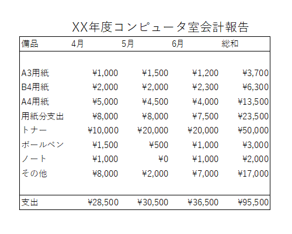
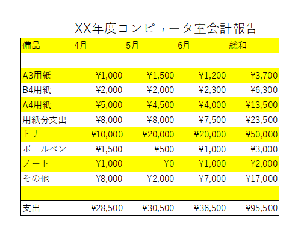

    

    
本講に関する学習動画

        

            
本講の授業内容に関する【説明動画】が1つあります。こちらの動画に加えて、本講で作成するファイルを完成させるために必要なExcelの機能について詳細に説明している【操作動画】もあります。操作動画は、その機能について説明している箇所で視聴できます。

            
注意：大人数が一斉に動画を再生すると動画が再生されないことがあります。時間をずらして視聴してください。

<button type="button" class="btn btn-info pull-right" data-toggle="modal" data-target="#autosumModal">
<!--
<button type="button" class="btn btn-info" data-toggle="modal" data-target="#autosumModal">-->
<i class="fa fa-play-circle-o fa-lg"></i>&nbsp;説明動画
</button>

<button type="button" class="close" data-dismiss="modal" aria-label="Close">&times;</button>
授業内容

<video>
<source type="video/mp4" src="../../../../../lit/video/xl01_basic2.mp4">
</video>

        

    

数式と関数
----------

関数は、Excel を初めとする表計算ソフトにおいて、とても重要な機能の一つです。
関数を用いることで、色々な種類の複雑な計算を一瞬で導き出すことができます。

次のファイルをダウンロードして、Excelで開いてください。そして、表を完成させてみましょう。

-   [いちご狩りファイル(ichigo.xlsx)](./ichigo.xlsx)


   
### 数式処理

数式処理はセルの先頭が（半角の）`=` で始まります。これをセルに直接入力、もしくは数式バーから入力します。



Excelで用いる主な算術演算子は以下のようなものがあります。

| 記号 | 処理内容             |
|------|----------------------|
| +    | 和（加算）           |
| -    | 差（減算）           |
| \*   | 積（乗算）           |
| /    | 商（除算）           |
| ^    | べき乗               |
| %    | パーセント（百分率） |

算術演算子はいずれも半角で入力します。
演算の優先順位は、基本的には通常通りですが、括弧 `()` を用いることもできます。
また、これ以外にも多くの関数による演算が可能です。



### SUM関数

    SUM(数値1,[数値2],...)

`SUM()` は、 `()` 内の数値の総和を求める関数です。
この関数を用いて、それぞれのいちごの "合計(g)" を求めます。
前回説明していますので、復習のつもりでやってみましょう。

  1. "F3" を選択します。
  2. 次に[ホーム]リボン - [編集]タブ - [オート SUM]をクリックします。
    
  3. すると、自動的に選択範囲が関数に入力されます。[Enter]を押すと、総和が "F3" に入力されます。
    

`SUM()` のように頻繁に利用する関数は、オートSUM 機能で簡単に挿入できます。
もちろん、関数を式として直接数式バーに入力しても構いません。

相対参照と絶対参照
----------------

Excel でデータを扱う上で、参照という概念を理解する必要があります。
ここで登場する **絶対参照** と **相対参照** を使い分けることで、より手軽に演算できるようになります。

### 相対参照

  1. オートフィルを使って、全ての合計を出します。
    選択したセルの右下にある四角の上にカーソルを持って行き、"F12" までドラッグします。
    
    
  2. Excelの数式の部分に注目します。 "F3" の数式が表示されています。
    
  3. 次に "F12" を選択します。すると、数式が変わりました。
    
    

オートフィルはコピー＆ペーストと同じ機能を果たしています。
しかし、ペーストされたのは、セル番号が違う数式です。
つまり、コピーされたセルに記録されていたのは、セル番号ではなく、セルの位置です。
これを **相対参照** と呼びます。

相対参照は入力されているセルを基点として、各セルの位置を決める参照方法です。
そのため、コピー＆ペーストした結果、ペーストされたセルから同じだけ移動した位置にあるセルを参照します。



### AVERAGE関数

    AVERAGE(数値1,[数値2],...)

`AVERAGE()` は、 `()` 内の数値の平均を求める関数です。
この関数を用いて、それぞれが平均でどのくらいのいちごを採ったのか調べてみましょう。

  1. まず "E13" を選択し，`平均` と入力します。
  2. 次に、"F13" を選択します。[ホーム]リボン - [編集]タブ - [オートSUM] の下向き矢印をクリック - [平均]をクリックします。
    
    
  3. [Enter] を押します。すると、平均が求められました。
    

### RANK関数

    RANK(数値,範囲,順序)

`RANK()` は、範囲内の数値が何番目の順位かを導き出します。
順序には `0`（降順／高い方が順位が高い）か `1`（昇順／低い方が順位が高い）のいずれかを設定します。

誰が一番いちごを採ったのかを求めることとします。

  1. "A3" を選択します。
  2. [ホーム]リボン - [編集]タブ - [オート SUM]の右下 - [その他の関数]をクリックします。
    もしくは、[数式]リボン - [関数ライブラリ]タブ - [関数の挿入]をクリックします。
    
  3. 関数の検索で検索をかければ出てきますが、ここでは[関数の分類] - [統計] - `RANK.EQ` - [OK]をクリックします。
    
    
  4. 関数の引数のウインドウの数値に順位を調べたい数値を入れます。ここでは、 "F3" を選択します。
  5. 次に範囲を比べる数値の全体を選択します。ここでは "F3" から "F12" までを選択します。
    さらに順序を降順にするために `0` と入れます。
    
    
  6. [Enter]を押します。すると、上杉さんの収穫量の順位が出ました。
    

### 絶対参照

一人目について順位が求められたため、オートフィルを用いてそれぞれの収穫量の順位を求めることとします。

  1. "A3" から "A12" までドラッグしてオートフィルを用います。
  2. A 列に順位が求められました。
    しかし、"A5" と "A6" 、 "A11" を見ると `2` が３つあります（緑枠）。
    これは順位としておかしいので、修正しなくてはなりません。 
  3. "A12" を選択して、数式を確認してください。
    相対参照しているため、RANK関数の範囲がずれていることがわかります。（赤枠がA3の範囲、青枠がA12の範囲を表す）
    
  4. ここで、絶対参照を使って、正しい順位を導き出しましょう。
    まず "A4" から "A12" までを選択 - 右クリック - [数式と値のクリア]でクリアします。
  5. "A3" を選択 - 数式バーの範囲の部分の `F3` にカーソルを移動 - [F4] キーを押します。
    
  6. F3` が `$F$3` に変わりました。`$` がついた列・行は、固定された状態になります。
    これが絶対参照の状態です。同様に "F12" も [F4] キーで絶対参照の状態にします。
  7. オートフィルで先ほどと同じように "A3" から "A12" まで伸ばします。
  8. 先ほどとは違う結果が出ました。 "A12" を選択して、範囲が移動していないことを確認してください。
    

これが **絶対参照** です。
絶対参照は表計算ソフト上のセル番号で位置を記録しておく参照方法です。
どの位置にあっても、同じセルを参照することができます。

絶対参照と相対参照をうまく使い分けることによって、より便利にExcelを使うことができます。

表を整える
-----------

同じようなものですが、多少変わった視点から表作りをしましょう。
四則演算や総和、オートフィルも再び練習します。
人口統計表の作成と重複する部分もありますが、何回も練習・確認することにより技術を磨きましょう。

以下の表を前回作った `rensyu.xlsx` の `Sheet2` に入力しますが、その前にセルの表示形式を設定します。
`rensyu.xlsx` にシートを追加します。
この追加された `Sheet2` に新たに値を入力します。



入力が終わったら、先にセルの表示形式を設定します。

### セルの表示形式（通貨スタイル）

ここでデータ入力前にセル "B3" から "E12" までの書式を通貨としましょう。操作は以下の通りです。

  1. "B3" から "E12" までをドラッグし、選択します
  2. [ホーム]リボン内の[数値]パネルの 標準 を 通貨 に変更します
  3. この書式を設定した後に、上の画像のデータを入力します。
    ただし、¥1,000 と入力せずに、単に `1000` と入力してください。
  4. 先ほどの設定によって、[表示形式]が 通貨 になっているため、Excelが自動的に通貨記号とカンマを補います。

入力が終わったら、集計計算を行います。簡単な整頓を行って、表を完成させましょう。

  1.  "A6" に `用紙分支出` と入力します。
  2.  4月の用紙消費金額を求めるため、"B6" に数式を入力します。
  3.  4月の支出総額を求めるため、"B12" に数式を入力します。
  4.  5月の用紙消費金額と支出総額を求めるための数式を、それぞれ "C6" 、 "C12" にオートフィルで入力します。
  5.  "D1" に `6月` と入力します。
  6.  6月の用紙消費金額と支出総額を求めるための数式を、それぞれ "D6" 、 "D12" にオートフィルで入力します。
    各備品の支出額はまだ空欄のままで問題ありません。
  7.  "E3" から "E10" まで、及び "E12" を各項目の4月から6月の総和として処理します。
  8.  6月の各項目に適当な数値を入力します。
    その総和と数式処理のセルがその入力値に従って変化することを確認してください。

### 表の表示の工夫

表の表示を工夫して、Excelで作った表を表計算のためのものだけでなく、レポート用、プレゼン用に利用することもできます。

#### 行や列のサイズの変更

前述のセルの調整でも行えますが、ここでは別の方法を紹介します。

  1. サイズ変更すべき行あるいは列全体を選択（行頭、列頭ラベルをクリックします）します。
  2. "ホーム"リボン内の"セル"パネルの[書式] - [行の高さ]もしくは[書式] - [列の幅]を選択します。
    
  3. ダイアログに現在の値が表示されます。調整したい値を入力します。
  4. "ホーム"リボン内の"配置"パネルで文字の配置を設定します。
    
    

#### 罫線の挿入

行、列の点線を実（点）線で囲みます。

  1. [ホーム]リボン内の[フォント]パネル内の右下にある  をクリックします。
    
  2. 表示されたウィンドウの上部にある[罫線]タブをクリックします。ここで詳細な設定が可能です。
    
  3. [ホーム]リボン内の[フォント]パネルでもある程度設定可能です。
    

#### フォントの変更

[ホーム]リボン内の[フォント]パネル内の右下にある  をクリックします。




[ホーム]リボン内の[フォント]パネルでも選択可能です。



#### セルの配色





  1. [ホーム]リボン内の[フォント]パネル内の右下にある をクリックします。
    
  2. [塗りつぶし]を選択します。ここでセルの背景の設定が出来ます。
    
  3. [ホーム]リボン内の[フォント]パネルでも指定することができます。
    

#### 印刷範囲

まず、印刷したい範囲を選択します（セル、行、列の選択）。
例えば上の例では "A1" から "E12" までを選択します。
[ページレイアウト]リボン内の[ページ設定]パネル内の[印刷範囲] - [印刷範囲の設定]をクリックします。

#### 印刷プレビュー

実際に印刷する前に、刷り上がりの確認を取ります。
 - [印刷] で表示されます。

#### 印刷

実際に印刷します。
 - [印刷] で表示されたプレビューを確認した上で、印刷ボタンをクリックします。

<strong>情報処理教室における制約事項</strong>

情報処理教室では、カラー印刷を行うことはできません。

### 実際の表示工夫例

以下は先ほど作った表の印刷プレビューです。
印刷範囲は "A1" から "D12" です。
表示の工夫は何もしていません。



これでも十分ですが、さらに工夫した方が見やすくなります。

  1. まずタイトルを入れます。
      - 1 行目全体をクリックして、選択します
      - 右クリックをして[挿入]で行を挿入します
      - "B1" に `XX年度コンピュータ室会計報告` と入力します
      - "B1" の文字列を `16pt` の大きさに変更します
  1. さらに罫線を引いたり、行や列、文字に色を付けます。
    

    

    

    
    

    

    

    

    
    

    

    

