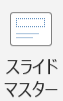
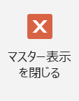
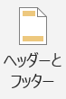
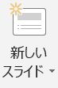
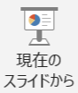
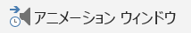
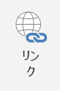
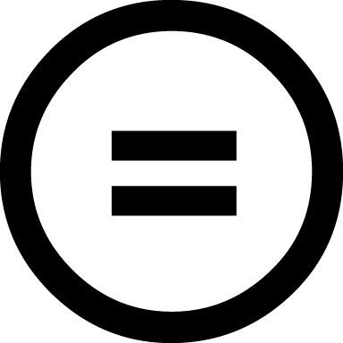

テーマを利用したスライドの作成
-------------------

### テーマの選択とスライドマスターの設定

内容を作り始める前に、スライド全体のデザインを考えましょう。

一つのプレゼンテーションでは、一つの流れのある内容を発表するため、全体の話が一貫して見えるように、スライドのデザインもある程度統一して作る必要があります。
具体的には、下記のような項目が各スライドで共通に表示したい項目です。

  * 背景デザイン
  * フッター
  * スライド番号

これは誰もが必ずすべきことではありませんが、もし自分のプレゼンテーションに必要だと思ったら積極的に利用しましょう。
使わない場合と見比べてみて、見やすいほうを使う、あるいはほかの人にアドバイスしてもらうなどして、ぜひいろいろと検討してみてください。
フッターにはページ情報、タイトル、プレゼンテーションの日付、会議名称・場所などを表示するのがよいでしょう。

まずここでは、これから作成するスライドに共通する背景のデザインを導入します。
PowerPoint にはさまざまなテーマが用意されています。
この中で自分の好みにあうものがあればそれを選択します。
もちろん自分で別のデザインを作ることも可能ですし、背景を単一色で統一することもできます。

  1. [デザイン]リボン - [テーマ]の中から使いたいデザインを選びます。
    
    テーマの  を押すとテーマのデザインの一覧を見ることができます。
    
    
    また、デザインの上にカーソルを置くと、現在のファイルにテーマを適用した場合のプレビューを見ることができます。
    
    さらに、各スライドの文字のフォントやサイズ、色、フッターなどを共通して設定するために、スライドの設定を行います。
  2. [表示]リボン -  をクリックします。
    
    
  3. フォントサイズや色、箇条書きのレベルなどを好きな形式に変更します。
    その形式が今後このプレゼンテーションを作成していくに際して、標準の設定となります。
    
  4.  をクリックして、通常表示に戻ります。
    
  5. [挿入]リボン -  をクリックします。
    
  6. 日付/時刻、フッター、(スライド番号)を設定し、[すべてに適用]をクリックします。
    **[すべてに適用]を押すと、全てのスライドが、[適用]を押すと選択したスライドのみが、設定されます。**
    
    

ここでの設定も必須ではありません。多くの項目は、テーマによって最初から設定されています。

### スライドの追加と削除

ここまででスライドの準備が終わりました。あとはプレゼンテーションの流れにあわせてスライドを作成していきます。
一般的に、プレゼンテーションの最初のスライドは「表紙」ですので、PowerPoint では最初の一枚目が自動的に表紙のレイアウトになっています。
レイアウトの変更も可能です。

[ホーム]リボン -  から必要なレイアウトのスライドを選択します。







このようにして、話したいことにあわせて、スライドを作っていきます。

間違って作ったスライドや、必要のないスライドを削除したい場合は、左の領域で削除するスライドを右クリックして [スライドの削除] をクリックします。



### スライドショー

スライドが完成したら、実際にスライドショーで見てみましょう。

[スライドショー]リボン - "スライドショーの開始"パネルにある  をクリックします。





また、複数スライドを作った場合、任意のスライドからスライドショーを始めたいときは、
[スライドショー]リボン - "スライドショーの開始"パネル -  をクリックします。



スライドは、あくまでもプレゼンテーションのための補助的な資料です。
発表者の話の内容と合っているか、視覚的な効果としてわかりやすいか、意味があるかなどの点をよくチェックしましょう。


Microsoft PowerPoint 2019の主な機能
-------------------

### 画面切り替え

画面切り替えとは、次のスライドに移る際の視覚的効果のことです。

#### 画面切り替えのアニメーションの設定

  1. 設定するスライドをクリックして表示します。
    １枚目のスライドから２枚目のスライドに移る際の画面切り替え効果は、２枚目のスライドをクリックします。
    
  2. [画面切り替え]リボンをクリックして画面切り替え効果を表示します。
    
  3. その他[▼]をクリックすると画面切り替え効果の一覧が表示されます。
    好きな画面切り替え効果をクリックし選択します。
    
    設定が完了したスライドにはスライド左横に[★]が表示されます。
  4. プレビューをクリックすると画面切り替え効果が再生されます。
    

### アニメーション

ここでは，最初に表示される3つの疑問に対し、それぞれの「答え」として順番に表示させます。

  1. [アニメーション]リボン -  をクリックします。
    画面右に "アニメーション ウィンドウ" が現れました。
    
    
  2. まず、一つめの答えになる"答え＝ 1時間から3時間"を選択します。
    
  3. [アニメーション]リボン - [アニメーションの追加] - [開始] - [スライドイン]をクリックします。
    
    
  4. アニメーションが追加されました。同様に他の二つの答えも設定します。
    

これでアニメーションの設定ができました。
[再生]や[アニメーション]リボン - [プレビュー]を押すと、アニメーションを確認できます。

"開始" や "方向"、 "速さ" を調節することによって、動きをつけたプレゼンテーション資料が作成できます。
[アニメーション]リボン - [効果のオプション] では、さらに詳細な設定を行うことができます。

[効果のオプション]は"アニメーションウィンドウ"でアニメーション横の[▼]からも表示できます。





### リンクの挿入

3つのWebページを紹介するときに、ハイパーリンクを利用しています。



文字にハイパーリンクを設定すると、多くのテーマでは文字色が変わり、下線が表示されます。
スライドショーでは、ハイパーリンクが設定された文字をクリックすることで、設定されたリンク先のスライドまでジャンプできます。

  1. リンクをはりたい "NASAのページ" を選択します。
    
  2. [挿入]リボン -  をクリックします。
    
  3. 7ページ目の "NASAのページ" にリンクをはります。選択をして、[OK] をクリックします。
    

文字色が変わり、下線が付きました。
スライドショーを実行し、リンクをクリックしてみると、7 ページ目の"NASAのページ"へリンクできていることが確認できます。





ハイパーリンクでは、ほかのファイルやWebページなどもリンク先として指定することができます。
例で示したスライドを参考に、さまざまな使い道を考えてみましょう。

### 表・画像・図の挿入

プレゼンテーション資料では、イメージを伝えるために画像を利用することもできます。



今回は 2 ページ目に、コンピューターの画像を配置します。
コンピュータ内にファイルとして保存されている画像を利用することもできますが、ここではオンライン画像を検索して挿入します。



  1. [挿入]リボン - [オンライン画像]をクリックします。
    
  2. "Bing イメージ検索" にキーワード `コンピュータ` を入力し、[Enter] キーをクリックします。
    
  3. Bing イメージ検索では、標準ではウェブ上のクリエイティブ・コモンズ・ライセンスが明記された画像を検索し、候補として表示します。
    画像をクリックし、下部のリンクをクリックすると出典のウェブページが表示されます。ライセンスを確認し、利用目的にあった画像を探してください。
    
  4. 任意の画像を選択し、挿入します。レイアウトを考えて、好きな場所に移動させてください。
    

なお、表を挿入したい場合は、エクセル（Excel2019）で作成した表をコピーして貼り付けることができます。
また、[挿入]リボン - [表]をクリックして、●行×●列の表を挿入することも可能です。

ほかにも、丸・三角形・直線などの図形、SmartArt（情報やアイディアの視覚的な表現）、棒グラフや円グラフなど、さまざまな図を活用できます。

著作物を利用する際の注意事項
-------------------

### 著作権

インターネットにおいて公開されている著作物には、一般的にライセンス（使用許諾）が明示されています。
著作物は、このライセンスに従って利用する必要があります。

ここでは著作権の考え方と、著作物のライセンスについて説明します。

#### 著作権

著作権は、著作物を創り出した人（著作者）に与えられる権利です。著作物を作成すると自動的に発生します。
著作者の権利を保護し、公正な利用で文化を発展させることを目的とし、日本では著作権法で定められている権利です。

著作者の不利益が生じないよう、著作物は適切に利用する必要があります。

#### 著作物

著作物について、著作権法では以下のように記載されています。

```
第二条　一　著作物　思想又は感情を創作的に表現したものであつて、文芸、学術、美術又は音楽の範囲に属するものをいう。
```

つまり、創作的に表現した作品であれば、小説・論文・音楽・絵画・図表・映画・写真・プログラムなど様々な形態のものが該当することが分かります。

#### 著作者の権利

著作権法では、著作物を著作者の財産として守るための権利を定めています。
下記に一例を紹介します。

<dl>
<dt>複製権（第21条）</dt>
<dd>
無断で複製（コピー）されない権利
</dd>
<dt>公衆送信権（第23条）</dt>
<dd>
無断で公衆に送信されない権利
</dd>
<dt>譲渡権・貸与権（第26条）</dt>
<dd>
無断で公衆に譲渡・貸与されない権利
</dd>
</dl>

これらの権利は、著作者の知らないところで著作物が勝手に利用されることを防ぎ、著作者が本来得るべき名声や金銭を適切に得るための権利です。

#### 例外的な利用

著作権法では、著作物を複製して利用する際には著作者の承認を得る必要があることが分かりました。
しかし、限定的な一部のケースでは著作者の承認を得ずに利用することができます。一例を紹介します。

  * 私的使用のための複製（第30条）
  * 図書館等における複製（第31条）
  * 引用（第32条）

特に利用する機会が多いものは**引用**です。
引用について規定した著作権法の条文を見てみましょう。

```
第三十二条　公表された著作物は、引用して利用することができる。この場合において、その引用は、公正な慣行に合致するものであり、かつ、報道、批評、研究その他の引用の目的上正当な範囲内で行われるものでなければならない。
```

例えば、レポートや論文では自分の主張を述べる上で必要な場合に他の資料を引用することがあります。自分の主張がメインであり引用部分が明確に区別できること、かつ出所（オリジナルの著作者名や著作物名など）が明示されていることなどが必要です。

  * [著作物が自由に使える場合は？ | 著作権って何？ | 著作権Q&A | 公益社団法人著作権情報センター　CRIC](http://www.cric.or.jp/qa/hajime/hajime7.html)

#### パブリックドメイン

パブリックドメインとは、著作権がない状態を示しています。著作権の保護期間（日本では作者の死後70年）が経過したものや、作者が著作権を放棄したものが該当します。

パブリックドメインと明記されている作品は、基本的に自由に利用することができます。

### クリエイティブ・コモンズ・ライセンス

パブリックドメインのように、著作権を気にせず利用できる作品は多くありません。

クリエイティブ・コモンズ・ライセンスは、[クリエイティブ・コモンズ プロジェクト](https://creativecommons.org/)が提唱する著作物を利用する際のルール（ライセンス）の一種です。４種類の条件のうち、著作物を利用する人に守ってもらいたいことを著作権者が組み合わせて明記します。この明記されたルールに沿った利用であれば、著作権者に承諾をとる必要はありません。

#### CCライセンスの種類

作品を利用（再配布やリミックス作品の公開、実演等）するための条件は４種類あります。
[クリエイティブ・コモンズ・ライセンスとは](http://creativecommons.jp/licenses/) より一部抜粋して説明します。

<div class="media">
<div class="media-left">

</div>
<div class="media-body">
<h5>表示</h5>
作品のクレジットを表示すること
</div>
</div>

<div class="media">
<div class="media-left">

</div>
<div class="media-body">
<h5>非営利</h5>
営利目的での利用をしないこと
</div>
</div>

<div class="media">
<div class="media-left">

</div>
<div class="media-body">
<h5>改変禁止</h5>
元の作品を改変しないこと
</div>
</div>

<div class="media">
<div class="media-left">

</div>
<div class="media-body">
<h5>継承</h5>
元の作品と同じ組み合わせのCCライセンスで公開すること
</div>
</div>

### 参考文献リスト

レポートやスライドを作成する際に利用した著作物は、出所を明記する必要があります。
参考文献リストとは、そうした著作物の出所が記された一覧のことで、基本的にはレポートやスライドの巻末に付記されます。

著作物の種類や学問分野によって、参考文献リストの形式に多少の違いはありますが、一般的に以下の情報を記載することが求められます。

  - 著作者名
  - 著作物が発表・公開された年
  - 著作物名
  - 著作物が発表・公開されている場所

なお、参考文献に図書や論文を載せる方法については、「情報リテラシー基礎」で実施された「学術情報検索実習」の資料を参考にしてください。

課題&#9312;
-------------------

ここまでの学習内容を踏まえて、実際にパワーポイントを用いてスライドを作成し、**１人３分～５分程度**でプレゼンテーションをしてみましょう。

以下に、いくつかテーマの案を挙げておきます。担当教員の指示に従って、取り組んでください。

- プレミアム・カレッジで学びたいと思っていたこと
- 今、夢中になっている趣味
- 出身地の隠れた魅力
- これから行ってみたい場所
- おすすめの季節

また、スライドを作成する際は、以下の点に気をつけてみましょう。

- 表紙を入れて３枚～５枚程度にまとめる
- 流れについては、「1.2. プレゼンテーションの内容と構成」を参考にする
- デザインについては、「1.5. スライドのデザイン」を参考にする
- 表、画像、図などを積極的に活用する
- 著作物の利用にあたっては、著作権に気をつける（必要に応じて出所を明記する）
